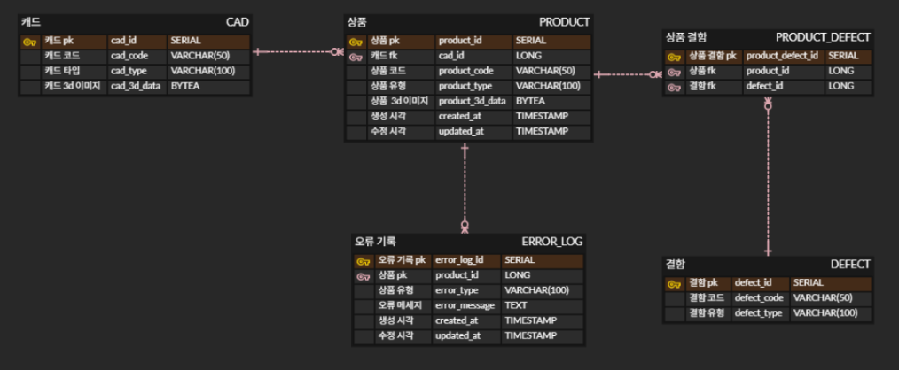

# PyQt DB 연동 계획

### 회의 배경

- PyQt 플랫폼에서 비즈니스 요구사항에 맞는 DB를 선택해야한다.
- 이에 Nosql과 RDB중 적합한 DB를 선택하고, 이를 구현할 계획을 수립한다.

### 결론

**데이터베이스**

- RDBMS인 PostgreSQL을 선택
- 데이터량이 크지 않으며, 커스터마이징 때 데이터의 정확성이 중요하다고 생각되었기 때문

**구현 계획**

- 위의 ERD에 맞추어 플랫폼에서 Entity를 정의하고, `sqlalchemy` ORM을 사용하여 데이터에 접근한다.

 ### 추후 계획

- 프로세스에 따라 성능을 더욱 최적화 할 수 있는 방안을 고려한다.

- 필요 시 성능, 요구사항에 따라 ERD 수정, NoSQL로의 이전 또는 결합을 고려한다.

  

