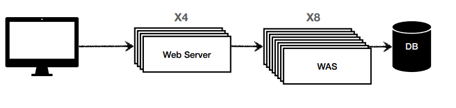

# HTTP 통신과 웹 시스템 구조

**참고자료**

해당 내용은 다음 강의를 참고하여 정리하였습니다.

[스프링 MVC 1편 - 백엔드 웹 개발 핵심 기술](https://www.inflearn.com/course/%EC%8A%A4%ED%94%84%EB%A7%81-mvc-1/dashboard)

### 서버간 통신, HTTP

서버간에는 다양한 데이터를 주고받는다.

- HTML, TEXT
- IMGAE, 음성, 영상 파일
- JSON, XML
- 기타 등등

이러한 데이터들를 HTTP 프로토콜을 사용하여 주고받는다.

HTTP 프로토콜의 세부내용은 설명생략

### 웹 시스템 구성

여러 구성이 있지만 대표적인 WEB, WAS, DB 구성을 살펴보자.

- 정적 리소스는 웹서버가 처리
- 동적인 처리가 필요하면 WAS에 요청을 위임
- WAS는 앱 로직에만 전담

장점

- 리소스 관리가 효율적이다.
  - 정적리소스가 많으면 Web서버를
  - 앱 리소스가 많으면 WAS를 증설한다.
- WAS, DB 장애시 Web서버가 오류화면을 제공해줄 수 있다.
  - Web은 잘 안죽는데 WAS, DB는 잘 죽음

