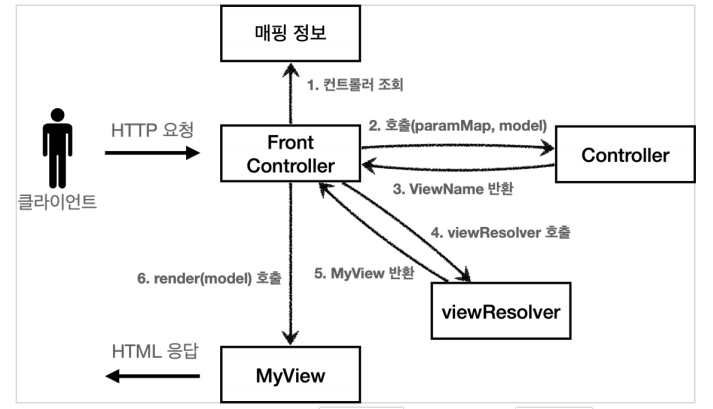

# 스프링 MVC V5

**참고자료**

해당 내용은 다음 강의를 참고하여 정리하였습니다.


[스프링 MVC 1편 - 백엔드 웹 개발 핵심 기술](https://www.inflearn.com/course/%EC%8A%A4%ED%94%84%EB%A7%81-mvc-1/dashboard)


### 스프링 MVC V4 구조



1. 프론트 컨트롤러에서 서블릿을 하나로 요청을 받는다.
2. 프론트 컨트롤러가 맵핑 URI에 맞는 컨트롤러를 찾아 호출
3. 컨트롤러가 비지니스 로직을 처리하고 **model에 데이터를 담고, viewName을 반환한다.**
   - V3의 ModelView는 (논리이름 + model)을 담음
   - V4에선 model을 param으로 받고 model에 데이터를 담고, viewName(논리이름) 반환

4. **ViewResolver 객체로 논리이름을 물리이름으로 변환한다.**

5. **MyView에 물리이름과 model을 넘겨준다.**
6. **MyView에서 model의 데이터를 가지고 뷰를 랜더링한다.**


### 스프링 MVC V1~4의 문제점

V1, V2, V3, V4 버전을 개발자가 선택적으로 사용할 수 없다.

-> 어뎁터 구조로 해결할 예정


### 스피링 MVC V5 구조


1. 프론트 컨트롤러에서 서블릿을 하나로 요청을 받는다.
2. **프론트 컨트롤러가 맵핑 URI에 맞는 핸들러를 찾는다.**
3. **해당 핸들러에 맞는 핸들러 어뎁터를 찾는다.**
4. **핸들러 어뎁터가 핸들러의 프로세스를 호출하고, ModelView를 반환한다.**
   - **핸들러가 비지니스 로직을 처리하고**
   - **이후 핸들러 어덥터에서 데이터를 가공하여 ModelView를 반환한다** 

5. **ModelView의 논리이름을 물리이름으로 바꾼다.**

6. **MyView에 물리이름과 model을 넘겨준다.**

7. **MyView에서 model의 데이터를 가지고 뷰를 랜더링한다.**


### 스피링 MVC V5 예시코드

FrontControllerV5

```java
@WebServlet(name = "frontControllerV5", urlPatterns = "/front-controller/v5/*")
public class FrontControllerServletV5 extends HttpServlet {

    private final Map<String, Object> handlerMappringMap = new HashMap<>();
    private final List<MyHandlerAdapter> handlerAdapters = new ArrayList<>();
	
    public FrontControllerServletV5(){
        initHandlerMappingMap();
        initHandlerAdapters();
    }
    // 1. URI와 핸들러 매핑 정보
    private void initHandlerMappingMap() {
        handlerMappringMap.put("/front-controller/v5/v3/members/new-form", new MemberFormControllerV3());
        handlerMappringMap.put("/front-controller/v5/v3/members/save", new MemberSaveControllerV3());
        handlerMappringMap.put("/front-controller/v5/v3/members", new MemberListControllerV3());
    }
    // 2. 처리가능한 어뎁터 목록 정보
    private void initHandlerAdapters() {
        handlerAdapters.add(new ControllerV3HandlerAdapter());
    }

    @Override
    protected void service(HttpServletRequest request, HttpServletResponse response) throws ServletException, IOException {
		
        // 3. 해당 URI에 맞는 핸들러를 찾는다.
        Object handler = getHandler(request);

        if (handler == null) {
            response.setStatus(HttpServletResponse.SC_NOT_FOUND);
            return;
        }
		
        // 4. 해당 핸들러에 맞는 어뎁터를 찾는다.
        MyHandlerAdapter handlerAdapter = getHandlerAdapter(handler);
		
        // 5. 어뎁터가 핸들러의 형태(인자값, 반환값)에 맞게
		//    - 핸들러의 프로세스 실행
        //    - modelView를 제작
        ModelView mv = handlerAdapter.handle(request, response, handler);
        
        // 8. 어뎁터가 만들어준 modelView로 View처리 진행
        // 	  - 뷰 리졸버로 물리이름 제작
        //    - 모델과 물리이름을 가지고 뷰 랜더링 처리
        String viewName = mv.getViewName();
        MyView view = viewResolver(viewName);

        view.render(mv.getModel(), request, response);
    }

    private MyHandlerAdapter getHandlerAdapter(Object handler) {
        for (MyHandlerAdapter handlerAdapter : handlerAdapters) {
            if (handlerAdapter.suppoerts(handler)){
                return handlerAdapter;
            }
        }
        throw new IllegalArgumentException("handler adapter를 찾을 수 없습니다. handler=" + handler);
    }

    private Object getHandler(HttpServletRequest request) {
        String requestURI = request.getRequestURI();
        return handlerMappringMap.get(requestURI);
    }

    private static MyView viewResolver(String viewName) {
        return new MyView("/WEB-INF/views/" + viewName + ".jsp");
    }
}

```


ControllerV3HandlerAdapterV3

```java
public class ControllerV3HandlerAdapter implements MyHandlerAdapter {
    @Override
    public boolean suppoerts(Object handler) {
        return (handler instanceof ControllerV3);
    }

    @Override
    public ModelView handle(HttpServletRequest request, HttpServletResponse response, Object handler) throws ServletException, IOException {
        
        ControllerV3 controller = (ControllerV3) handler;
		
        // 6. 핸들러 V3의 버전에 맞게 param을 넘겨준다. 
        Map<String, String> paramMap = createParamMap(request);
        // 7. 핸들러 V3의 버전에 맞게 반환값들로 modelView를 만들어준다.
        ModelView mv = controller.process(paramMap);

        return mv;
    }

    private static Map<String, String> createParamMap(HttpServletRequest request) {
        Map<String, String> paramMap = new HashMap<>();
        request.getParameterNames().asIterator()
                .forEachRemaining(paramName -> paramMap.put(paramName, request.getParameter(paramName)));
        return paramMap;
    }

}
```


### 스피링 MVC V5에 V4버전 추가하기

FrontControllerV5

```java
@WebServlet(name = "frontControllerV5", urlPatterns = "/front-controller/v5/*")
public class FrontControllerServletV5 extends HttpServlet {

    private final Map<String, Object> handlerMappringMap = new HashMap<>();
    private final List<MyHandlerAdapter> handlerAdapters = new ArrayList<>();

    public FrontControllerServletV5(){
        initHandlerMappingMap();
        initHandlerAdapters();
    }
    private void initHandlerMappingMap() {
        handlerMappringMap.put("/front-controller/v5/v3/members/new-form", new MemberFormControllerV3());
        handlerMappringMap.put("/front-controller/v5/v3/members/save", new MemberSaveControllerV3());
        handlerMappringMap.put("/front-controller/v5/v3/members", new MemberListControllerV3());

        // ** V4 추가
        handlerMappringMap.put("/front-controller/v5/v4/members/new-form", new MemberFormControllerV4());
        handlerMappringMap.put("/front-controller/v5/v4/members/save", new MemberSaveControllerV4());
        handlerMappringMap.put("/front-controller/v5/v4/members", new MemberListControllerV4());
    }
    private void initHandlerAdapters() {
        handlerAdapters.add(new ControllerV3HandlerAdapter());
        
        // ** V4 추가
        handlerAdapters.add(new ControllerV4HandlerAdapter());
    }

    @Override
    protected void service(HttpServletRequest request, HttpServletResponse response) throws ServletException, IOException {

        Object handler = getHandler(request);

        if (handler == null) {
            response.setStatus(HttpServletResponse.SC_NOT_FOUND);
            return;
        }

        MyHandlerAdapter handlerAdapter = getHandlerAdapter(handler);

        ModelView mv = handlerAdapter.handle(request, response, handler);
        String viewName = mv.getViewName();
        MyView view = viewResolver(viewName);

        view.render(mv.getModel(), request, response);
    }

    private MyHandlerAdapter getHandlerAdapter(Object handler) {
        for (MyHandlerAdapter handlerAdapter : handlerAdapters) {
            if (handlerAdapter.suppoerts(handler)){
                return handlerAdapter;
            }
        }
        throw new IllegalArgumentException("handler adapter를 찾을 수 없습니다. handler=" + handler);
    }

    private Object getHandler(HttpServletRequest request) {
        String requestURI = request.getRequestURI();
        return handlerMappringMap.get(requestURI);
    }

    private static MyView viewResolver(String viewName) {
        return new MyView("/WEB-INF/views/" + viewName + ".jsp");
    }
}

```


ControllerV4HandlerAdapter

```java
public class ControllerV4HandlerAdapter implements MyHandlerAdapter {
    @Override
    public boolean suppoerts(Object handler) {
        return (handler instanceof ControllerV4);
    }

    @Override
    public ModelView handle(HttpServletRequest request, HttpServletResponse response, Object handler) throws ServletException, IOException {
        ControllerV4 controller = (ControllerV4) handler;
		
        // 핸들러 버전에 맞게 인자값을 넣어줌
        Map<String, String> paramMap = createParamMap(request);
        HashMap<String, Object> model = new HashMap<>();
        String viewName = controller.process(paramMap, model);

        // 핸들러 버전에 맞게 반환값으로 modelView를 만들어서 반환
        ModelView mv = new ModelView(viewName);
        mv.setModel(model);

        return mv;
    }

    private static Map<String, String> createParamMap(HttpServletRequest request) {
        Map<String, String> paramMap = new HashMap<>();
        request.getParameterNames().asIterator()
                .forEachRemaining(paramName -> paramMap.put(paramName, request.getParameter(paramName)));
        return paramMap;
    }
}
```

