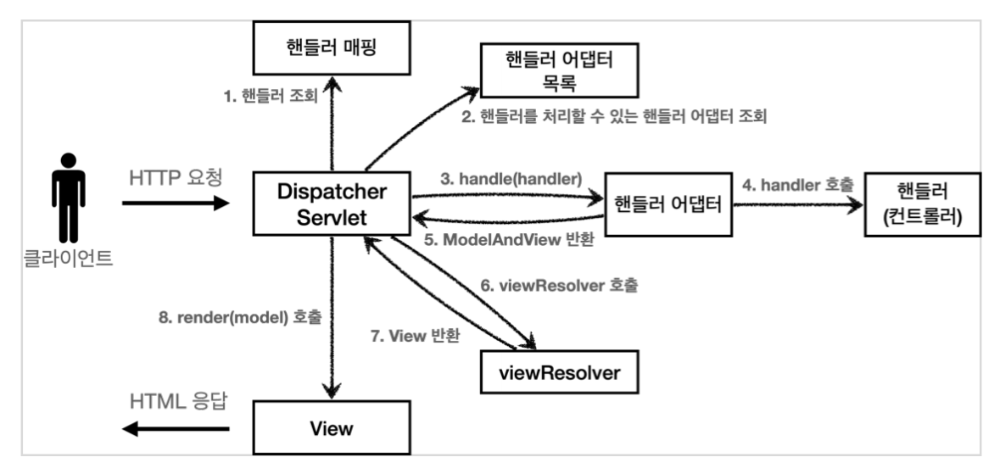

# 실제 스프링 MVC 구조

**참고자료**

해당 내용은 다음 강의를 참고하여 정리하였습니다.


[스프링 MVC 1편 - 백엔드 웹 개발 핵심 기술](https://www.inflearn.com/course/%EC%8A%A4%ED%94%84%EB%A7%81-mvc-1/dashboard)


### 실제 스프링 MVC 구조



1. DispatcherServlet에서 서블릿을 하나로 요청을 받는다.
2. DispatcherServlet이 맵핑 URI에 맞는 핸들러를 찾는다.
3. 해당 핸들러에 맞는 핸들러 어뎁터를 찾는다.
4. 핸들러 어뎁터가 핸들러의 프로세스를 호출하고, ModelView를 반환한다.
   - 핸들러가 비지니스 로직을 처리하고
   - 이후 핸들러 어덥터에서 데이터를 가공하여 ModelView를 반환한다 
5. viewResolver에서 ModelView의 논리이름을 물리이름으로 바꾼다.
6. MyView에 물리이름과 model을 넘겨준다.
7. MyView에서 model의 데이터를 가지고 뷰를 랜더링한다.


### DispatcherServlet의 doDispatch()메서드

```java
public class DispatcherServlet extends FrameworkServlet {

    protected void doDispatch(HttpServletRequest request, HttpServletResponse response) throws Exception {
        HttpServletRequest processedRequest = request;
        HandlerExecutionChain mappedHandler = null;
        ModelAndView mv = null;
        
        // 1. 핸들러 조회
        mappedHandler = getHandler(processedRequest);
        if (mappedHandler == null) {
            noHandlerFound(processedRequest, response);
            return;
        }
        
        // 2. 핸들러 어댑터 조회 - 핸들러를 처리할 수 있는 어댑터
        HandlerAdapter ha = getHandlerAdapter(mappedHandler.getHandler());
        
        // 3. 핸들러 어댑터 실행 -> 4. 핸들러 어댑터를 통해 핸들러 실행 -> 5. ModelAndView 반환
        mv = ha.handle(processedRequest, response, mappedHandler.getHandler());
        processDispatchResult(processedRequest, response, mappedHandler, mv,
                              dispatchException);
    }
    
    private void processDispatchResult(HttpServletRequest request, HttpServletResponse response, HandlerExecutionChain mappedHandler, ModelAndView mv, Exception exception) throws Exception {
        // 뷰 렌더링 호출
        render(mv, request, response);
    }
    
    protected void render(ModelAndView mv, HttpServletRequest request, HttpServletResponse response) throws Exception {
        
        View view;
        String viewName = mv.getViewName();
        
        // 6. 뷰 리졸버를 통해서 뷰 찾기, 7. View 반환
        view = resolveViewName(viewName, mv.getModelInternal(), locale, request);
        // 8. 뷰 렌더링
        view.render(mv.getModelInternal(), request, response);
    }
}
```

