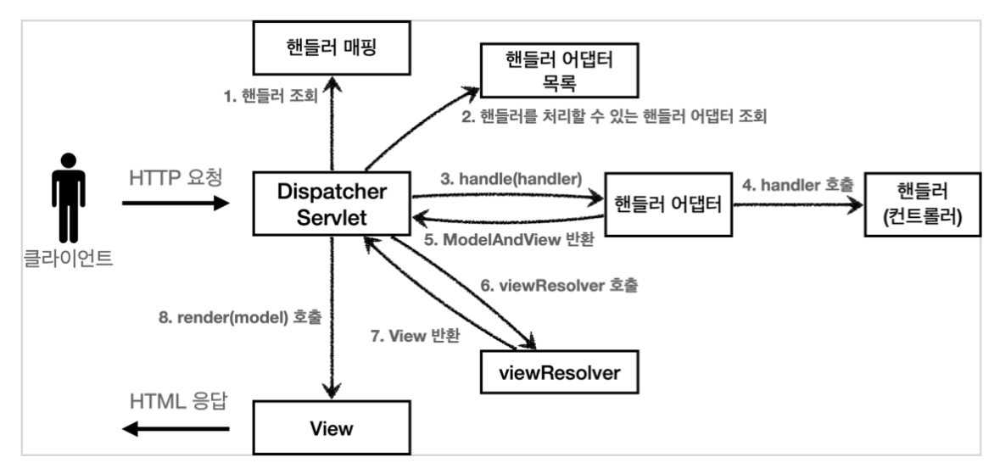

# 스프링 MVC의 핸들러와 핸들러 어뎁터

**참고자료**

해당 내용은 다음 강의를 참고하여 정리하였습니다.


[스프링 MVC 1편 - 백엔드 웹 개발 핵심 기술](https://www.inflearn.com/course/%EC%8A%A4%ED%94%84%EB%A7%81-mvc-1/dashboard)


### 스프링 MVC의 구조



스프링 MVC구조는 다음과 같으며

개발자가 작성한 버전에 맞는 Controller를 처리하려면

HandlerMapping에서 핸들러를 찾을 수 있어야 하고,

HandlerAdapter목록에서 버전에 맞는 어뎁터를 찾아야 한다.


### HandlerMapping, 핸들러 찾는 방법

HandlerMapping은 ULI의 엔드포인트를 기준으로 핸들러를 찾는데,

하나의 인터페이스로 여러 구현클래스들이 있다.

(핸들러 목록에 추가하는 방법이 여러가지가 있는거 같음)


1. RequestMappingHandlerMapping

- 어노테이션 기반의 컨트롤러인 @RequestMapping 벨류값이 URI 엔드포인트와 같은 핸들러

2. BeanNameUrlHandlerMapping

- 스프링 빈의 이름이 URI 엔드포인트와 같은 핸들러


등 다음과 같은 방식으로 HandlerMapping이 URI요청이 왔을 떄, 핸들러를 찾아준다.


### HandlerAdapter, 핸들러 어뎁터 찾는 방법

HandlerAdapter 또한 하나의 인터페이스로 여러 구현체들이 있다.

(각 핸들러를 처리할 수 있는 어뎁터들이 하나씩 있다.)


1. RequestMappingHandlerAdapter
   - 애노테이션 기반의 컨트롤러인 @RequestMapping을 처리하는 핸들러
2. HttpRequestHandlerAdapter
   - HttpRequestHandler 처리하는 핸들러
3. SimpleControllerHandlerAdapter
   - Controller 인터페이스(애노테이션X, 과거에 사용) 처리하는 핸들러


핸들러 어뎁터 목록에서 어뎁터 목록을 for문 돌린다.

HandlerAdapter는 supports 매서드로 각 핸들러에 맞는 어뎁터인지 확인하고,

해당 핸들러를 처리할 수 있는 핸들러를 반환한다.


예시코드

DispatcherServlet의 getHandlerAdapter()

```java
protected HandlerAdapter getHandlerAdapter(Object handler) throws ServletException {
    if (this.handlerAdapters != null) {
        for (HandlerAdapter adapter : this.handlerAdapters) {
            if (adapter.supports(handler)) {
                return adapter;
            }
        }
    }
}
```

각 Adapter들의 supports메서드

```java
// AbstractHandlerMethodAdapter의 supports메서드
@Override
public final boolean supports(Object handler) {
    return (handler instanceof HandlerMethod handlerMethod && supportsInternal(handlerMethod));
}

// HttpRequestHandlerAdapter의 supports메서드
@Override
public boolean supports(Object handler) {
    return (handler instanceof HttpRequestHandler);
}
```


각 핸들러를 찾을 수 있는 어뎁터를 찾은 후, 어뎁터가 handle 메서드를 통해

1. 핸들러의 비지니스 로직 처리
2. ModelAndView 제작 및 반환

을 해준다.


### 예시코드

OldController

```java
@Component("/springmvc/old-controller")
public class OldController implements Controller {
    
    @Override
    public ModelAndView handleRequest(HttpServletRequest request, HttpServletResponse response) throws Exception {
        return new ModelAndView("new-form");
    }
}
```


1. 핸들러 매핑으로 핸들러 목록 조회
   - BeanNameUrlHandlerMapping 유형으로 핸들러 조회가 성공하고, OldController가 반환된다.

2. getHandlerAdapter() 호출

   - 핸들러 어뎁터 목록을 돌아가며 해당 핸들러를 처리할 수 있는 어뎁터를 찾는다.

   - SimpleControllerHandlerAdapter가 적절한 어뎁터로 해당 어뎁터가 반환된다.

3. 핸들러 어댑터 실행
   - `HandlerAdapter handlerAdapter.handle()`에 `SimpleControllerHandlerAdapter`가 담겨 있음
   - OldController의 버전에 맞게 비지니스 로직 처리, ModelAndView 제작