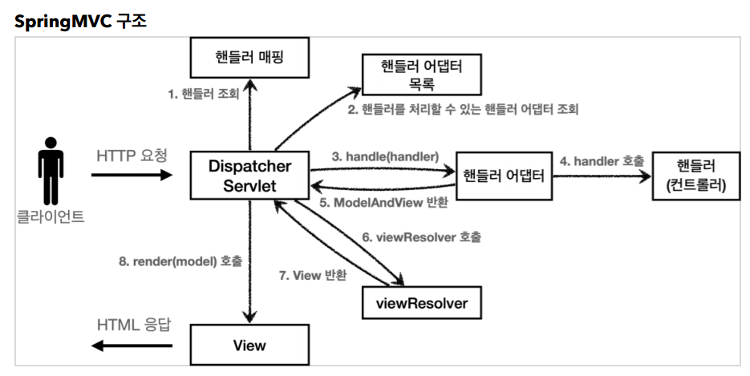
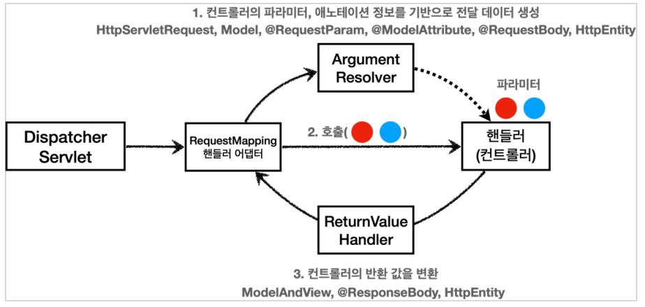
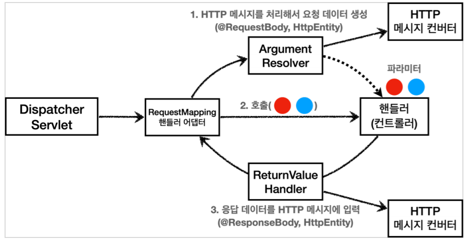

# HTTP 메시지 컨버터

**참고자료**

해당 내용은 다음 강의를 참고하여 정리하였습니다.

[스프링 MVC 1편 - 백엔드 웹 개발 핵심 기술](https://www.inflearn.com/course/%EC%8A%A4%ED%94%84%EB%A7%81-mvc-1/dashboard)

### SpringMVC 구조에서 핸들러 어뎁터 세부구조

DispatcherServlet에서 HTTP 요청을 받고 핸들러 어뎁터 목록을 찾아 적절한 RequestMapping 핸들러 어뎁터를 사용한다.

RequestMapping에서는 핸들러 어뎁터에서 HTTP요청과 응답을 각색하여 핸들러를 보조한다.

1. HTTP 요청
   - ArgumentResolver가 모든 파라미터를 만들어 준다.
   - RequestMapping 핸들러 어뎁터는 @Nullable로 모든 파라미터를 핸들러로 넣어준다.
   - 핸들러가 다양한 파라미터를 받을 수 있는 이유
2. HTTP 응답
   - ReturnValueHandler가 핸들러의 반환값을 HTTP body에 어떻게 넣을지 알아서 처리해준다.
   - ex) @Response가 있는 핸들러의 String반환값은 뷰이름이 아닌 HTTP body에 바로 넣는다.

### HTTP 메시지 컨버터

#### HTTP 요청 Json 데이터를 받을 때

ArgumentResolver가 모든 인자를 생성하여 파라미터로 전달해주는데

@RequestBody나 HttpEntity를 파라미터로 만들때는 HTTP 메시지 컨버터가 동작한다.

Json데이터를 객체로 변환해준다.

#### HTTP 응답 Json 데이터를 만들 때

RetuneValueHandler가 응답데이터를 만들 때,

@ResponseBody나 HttpEntity로 객체를 반환하고 싶을 때 HTTP 메시지 컨버터가 동작한다.

객체를 Json데이터로 변환하여 준다.

