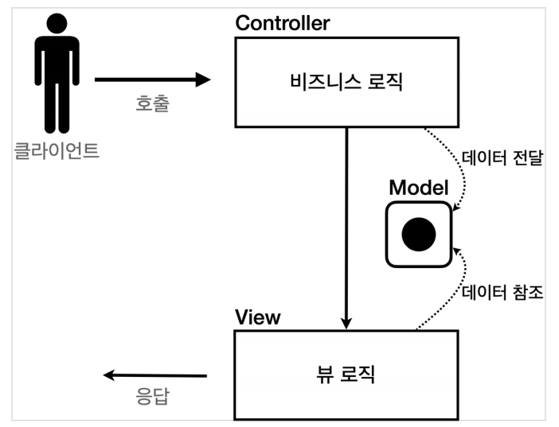

# MVC 패턴으로 웹 어플리케이션 개발

**참고자료**

해당 내용은 다음 강의를 참고하여 정리하였습니다.


[스프링 MVC 1편 - 백엔드 웹 개발 핵심 기술](https://www.inflearn.com/course/%EC%8A%A4%ED%94%84%EB%A7%81-mvc-1/dashboard)


### 서블릿과 템플릿 엔진의 한계

1. 너무 많은 역할

   - 하나의 서블릿이나 JSP만으로 개발 시 

     - 비즈니스 로직과 뷰 렌더링까지 모두 처리, 너무 많은 역할
     - HTML 코드 하나 수정해야 하는데, 수백줄의 자바 코드

     - 비즈니스 로직을 하나 수정해야 하는데, 수백 수천줄의 HTML 코드

2. 변경의 라이플 사이클이 다름

   - UI와 비지니스 로직을 수정하는 일은 다르게 발생

   - 그리고 서로에게 영향을 주지 않음

   - 라이프 사이클이 다른 두 부분을 하나의 코드로 관리하는 것은 유지보수에 좋지 않음

3. 기능특화
   - 뷰 템플릿은 화면을 렌더링하는데 최적화
   - 화면만 담당하는게 효과적


### MVC 패턴의 등장



1. 컨트롤러

- HTTP 요청을 받아서 파라미터를 검증
- 비즈니스 로직을 실행
- 뷰에 전달할 결과 데이터를 조회해서 모델에 담는다.

2. 모델

- 뷰에 출력할 데이터를 담아둔다.

3. 뷰

- 모델에 담겨있는 데이터를 사용해서 화면을 그리는 일에 집중


뷰가 필요한 데이터를 모두 모델에 담아서 전달해주는 덕분에 뷰는 비즈니스 로직이나 데이터 접근을 몰라도 되고, 화면을 렌더링 하는 일에 집중할 수 있다.


### MVC 예시코드

컨트롤러

```java
@WebServlet(name = "mvcMemberListServlet", urlPatterns = "/servlet-mvc/members")
public class MvcMemberListServlet extends HttpServlet {
    
    private MemberRepository memberRepository = MemberRepository.getInstance();
    
    @Override protected void service(HttpServletRequest request, HttpServletResponse response) throws ServletException, IOException {
        
        List<Member> members = memberRepository.findAll();
        request.setAttribute("members", members);
        
        String viewPath = "/WEB-INF/views/members.jsp";
        RequestDispatcher dispatcher = request.getRequestDispatcher(viewPath);
        dispatcher.forward(request, response);
    }
}
```

- 컨트롤러에서 Http요청을 받고, 비지니스 로직을 처리한 후, 데이터를 모델에 담는다
  - request.setAttribute로 request객체의 작은 저장공간을 활용


뷰

```jsp
<%@ page contentType="text/html;charset=UTF-8" language="java" %>
<%@ taglib prefix="c" uri="http://java.sun.com/jsp/jstl/core"%>
<html>
    <head>
        <meta charset="UTF-8">
        <title>Title</title>
    </head>
    <body>
        <a href="/index.html">메인</a>
        <table>
            <thead>
                <th>id</th>
                <th>username</th>
                <th>age</th>
            </thead>
            <tbody>
                <c:forEach var="item" items="${members}">
                    <tr> <td>${item.id}</td>
                        <td>${item.username}</td>
                        <td>${item.age}</td>
                    </tr>
                </c:forEach>
            </tbody>
        </table>
    </body>
</html>
```

- 뷰에서 모델에 담긴 데이터를 활용하여 동적 Html을 랜더링한다.


### MVC패턴의 개선점과 한계점

개선점

- 비지니스 로직과 뷰를 렌더링하는 역할을 확실하게 분리할 수 있다.
- 코드가 직관적이고 깔끔해졌다.


한계

1. 포워드 중복

   - ```java
     RequestDispatcher dispatcher = request.getRequestDispatcher(viewPath);
     dispatcher.forward(request, response);
     ```

2. viewPath 중복

   - ```java
     String viewPath = "/WEB-INF/views/new-form.jsp";
     ```

   - prefix: /WEB-INF/views/, suffix: .jsp

   - 만약 jsp가 아닌 thymeleaf같은 것으로 템플릿 엔진을 교체하면 관련 코드를 모두 변경해야한다.

3. 사용하지 않는 코드

   - ```java
     HttpServletRequest request, HttpServletResponse response
     ```

4. 공통 처리가 어렵다.
   - 프론트 컨트롤러 패턴도입으로 해결


