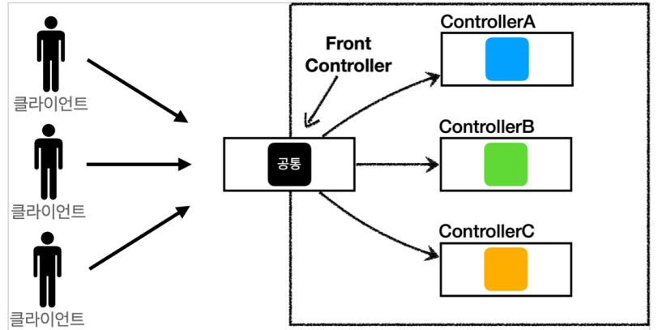
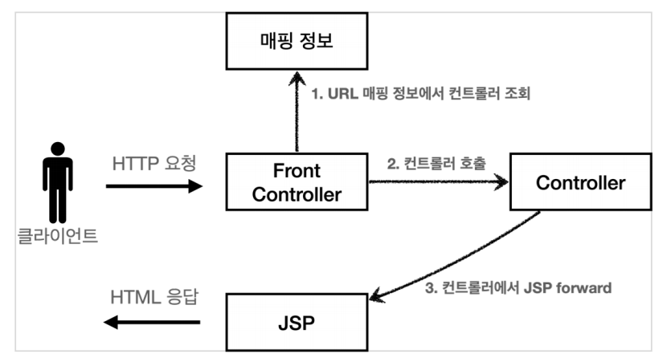

# 스프링 MVC V1

### 프론트 컨트롤러



- 프론트 컨트롤러에서 서블릿을 하나로 요청을 받는다.
- 프론트 컨트롤러가 맵핑 URI에 맞는 컨트롤러를 찾아 호출
- 이로써 여러 컨트롤러의 공통처리가 가능해진다.


### 스프링 MVC V1 구조




### 예시코드

FrontController

```java
@WebServlet(name = "frontControllerServletV1", urlPatterns = "/front-controller/v1/*")
public class FrontControllerServletV1 extends HttpServlet {

    private Map<String, ControllerV1> controllerMap = new HashMap<>();

    // 1. 매핑정보
    public FrontControllerServletV1() {
        controllerMap.put("/front-controller/v1/members/new-form", new MemberFormControllerV1());
        controllerMap.put("/front-controller/v1/members/save", new MemberSaveControllerV1());
        controllerMap.put("/front-controller/v1/members", new MemberListControllerV1());
    }

    @Override
    protected void service(HttpServletRequest request, HttpServletResponse response) throws ServletException, IOException {

        String requestURI = request.getRequestURI();
		
        // 2. URI에 맞는 컨트롤러 가져오기
        ControllerV1 controller = controllerMap.get(requestURI);

        if (controller == null) {
            response.setStatus(HttpServletResponse.SC_NOT_FOUND);
            return;
        }
		
        // 3. 컨트롤러 프로세스 호출
        controller.process(request,response);
    }
}
```


MemberListControllerV1

```java
public class MemberListControllerV1 implements ControllerV1 {

    private MemberRepository memberRepository = MemberRepository.getInstance();
	
    // 4. 컨트롤러 프로세스 수행
    @Override
    public void process(HttpServletRequest request, HttpServletResponse response) throws ServletException, IOException {
        
        // 5. 비지니스 로직 수행
        List<Member> members = memberRepository.findAll();

        // 6. request 저장공간에 데이터를 담기
        // 7. jsp viewPath 설정
        request.setAttribute("members", members);	
        
        String viewPath = "/WEB-INF/views/members.jsp";
        RequestDispatcher dispatcher = request.getRequestDispatcher(viewPath);
        dispatcher.forward(request, response);

    }
}
```


### V2에서 개선될 문제점

모든 컨트롤러에서 viewPath를 반환하는 부분이 중복된다.

```java
String viewPath = "/WEB-INF/views/new-form.jsp";
RequestDispatcher dispatcher = request.getRequestDispatcher(viewPath);
dispatcher.forward(request, response);
```


이 컨트롤러에서 jsp로 넘어가는 부분을 View객체를 만들어서 처리할 예정
