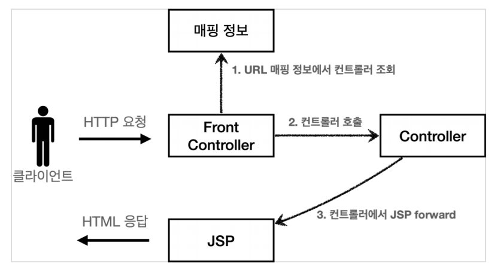

# 스프링 MVC V2 - View의 분리

### 스프링 MVC V1 구조



1. 프론트 컨트롤러에서 서블릿을 하나로 요청을 받는다.

2. 프론트 컨트롤러가 맵핑 URI에 맞는 컨트롤러를 찾아 호출

3. 컨트롤러가 비지니스 로직을 처리하고 jsp를 forward한다.
   - 이 부분을 리팩토링할 예정


### 스프링 MVC V1의 문제점

모든 컨트롤러에서 viewPath를 반환하는 부분이 중복된다.

```java
String viewPath = "/WEB-INF/views/new-form.jsp";
RequestDispatcher dispatcher = request.getRequestDispatcher(viewPath);
dispatcher.forward(request, response);
```


이 컨트롤러에서 jsp로 넘어가는 부분을 View객체를 만들어서 처리할 예정


### 스피링 MVC V2 구조


1. 프론트 컨트롤러에서 서블릿을 하나로 요청을 받는다.

2. 프론트 컨트롤러가 맵핑 URI에 맞는 컨트롤러를 찾아 호출

3. 컨트롤러가 비지니스 로직을 처리하고 **View객체를 반환한다**

4. MyView로 jsp파일을 랜더링한다.
   - jsp로 forward하는걸 뷰를 랜더링한다고 표현함


### 스피링 MVC V2 예시코드

FrontController V2

```java
@WebServlet(name = "frontControllerServletV2", urlPatterns = "/front-controller/v2/*")
public class FrontControllerServletV2 extends HttpServlet {

    private Map<String, ControllerV2> controllerMap = new HashMap<>();
	
    // 1. 매핑정보
    public FrontControllerServletV2() {
        controllerMap.put("/front-controller/v2/members/new-form", new MemberFormControllerV2());
        controllerMap.put("/front-controller/v2/members/save", new MemberSaveControllerV2());
        controllerMap.put("/front-controller/v2/members", new MemberListControllerV2());
    }

    @Override
    protected void service(HttpServletRequest request, HttpServletResponse response) throws ServletException, IOException {
		
        // 2. URI에 맞는 컨트롤러 가져오기
        String requestURI = request.getRequestURI();
        ControllerV2 controller = controllerMap.get(requestURI);

        if (controller == null) {
            response.setStatus(HttpServletResponse.SC_NOT_FOUND);
            return;
        }

        // v1코드
        // controller.process(request,response);
		
        // 3. 컨트롤러 프로세스 호출
        MyView view = controller.process(request, response);
        
        // 8. MyView의 랜더링 함수를 통해 jsp forward (뷰 랜더링)
        view.render(request, response);
    }
}
```


MemberListControllerV2

```java
public class MemberListControllerV2 implements ControllerV2 {
    private MemberRepository memberRepository = MemberRepository.getInstance();
	
    // 4. 컨트롤러 프로세스 수행
    @Override
    public MyView process(HttpServletRequest request, HttpServletResponse response) throws ServletException, IOException {
        
        // 5. 비지니스 로직 수행
        List<Member> members = memberRepository.findAll();
		
        // 6. request 저장공간에 데이터를 담기
        request.setAttribute("members", members);

        // V1 코드
        // String viewPath = "/WEB-INF/views/members.jsp";
        // RequestDispatcher dispatcher = request.getRequestDispatcher(viewPath);
        // dispatcher.forward(request, response);
		
        // 7. MyView 객체를 생성하고 반환
        return new MyView("/WEB-INF/views/members.jsp");
    }
}

```


MyView

```java
@AllArgsConstructor
public class MyView {
    
    private String viewPath;
    
    public void render(HttpServletRequest request, HttpServletResponse response) throws ServletException, IOException{
        RequestDispatcher dispatcher = request.getRequestDispatcher(viewPath);
        dispatcher.forward(request, response);
    }
}

```


### V3에서 개선될 문제점

1. 컨트롤러의 서블릿 종속성 제거

컨트롤러에서 HttpServletRequest, HttpServletResponse를 사용하지 않도록 변경할 예정


2. 뷰 이름 중복제거

```java
return new MyView("/WEB-INF/views/members.jsp");
```

컨트롤러가 물리이름이 아닌 논리 이름("new-form")을 반환하고 실제 물리이름은 프론트 컨트롤러에서 처리할 예정
