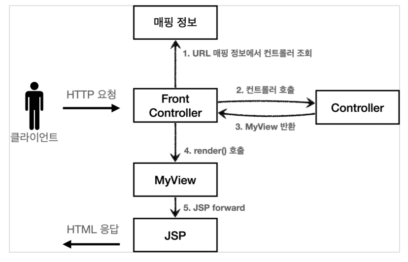

# 스프링 MVC V3

**참고자료**

해당 내용은 다음 강의를 참고하여 정리하였습니다.


[스프링 MVC 1편 - 백엔드 웹 개발 핵심 기술](https://www.inflearn.com/course/%EC%8A%A4%ED%94%84%EB%A7%81-mvc-1/dashboard)


### 스프링 MVC V2 구조



1. 프론트 컨트롤러에서 서블릿을 하나로 요청을 받는다.

2. 프론트 컨트롤러가 맵핑 URI에 맞는 컨트롤러를 찾아 호출

3. 컨트롤러가 비지니스 로직을 처리하고 **View 객체를 반환한다**

4. MyView로 jsp파일을 랜더링한다.
   - jsp로 forward하는걸 뷰를 랜더링한다고 표현함


### 스프링 MVC V2의 문제점

1. 컨트롤러가 서블릿에 종속적이다.

- model을 도입할 것

2. 컨트롤러에서 뷰로 넘어갈 때, 물리이름으로 넘어간다.

- 뷰 리졸버를 도입하여 논리이름으로 물리이름을 반환할 예정


### 스피링 MVC V3 구조


1. 프론트 컨트롤러에서 서블릿을 하나로 요청을 받는다.
2. 프론트 컨트롤러가 맵핑 URI에 맞는 컨트롤러를 찾아 호출
3. 컨트롤러가 비지니스 로직을 처리하고 **ModelView 객체를 반환한다.**
   - 뷰에 필요한 정보를 담고있다. (논리이름 + 데이터)

4. **ViewResolver 객체로 논리이름을 물리이름으로 변환한다.**

5. **MyView에 물리이름과 ModelView의 model을 넘겨준다.**
6. **MyView에서 model의 데이터를 가지고 뷰를 랜더링한다.**


### 스피링 MVC V3 예시코드

FrontControllerV3

```java
@WebServlet(name = "frontControllerServletV3", urlPatterns = "/front-controller/v3/*")
public class FrontControllerServletV3 extends HttpServlet {

    private Map<String, ControllerV3> controllerMap = new HashMap<>();

    // 1. 매핑정보
    public FrontControllerServletV3() {
        controllerMap.put("/front-controller/v3/members/new-form", new MemberFormControllerV3());
        controllerMap.put("/front-controller/v3/members/save", new MemberSaveControllerV3());
        controllerMap.put("/front-controller/v3/members", new MemberListControllerV3());
    }

    @Override
    protected void service(HttpServletRequest request, HttpServletResponse response) throws ServletException, IOException {
		
        // 2. URI에 맞는 컨트롤러 가져오기
        String requestURI = request.getRequestURI();

        ControllerV3 controller = controllerMap.get(requestURI);

        if (controller == null) {
            response.setStatus(HttpServletResponse.SC_NOT_FOUND);
            return;
        }

        // v2코드
        // MyView view = controller.process(request, response);
        // view.render(request, response);

        // 3. request parameter들을 Map에 담아서 controller로 보내주기
        //    컨트롤러 서블릿 종속성 제거
        Map<String, String> paramMap = createParamMap(request);
		
        // 4. 파라미터 정보로 비지니스 로직 처리
        ModelView mv = controller.process(paramMap);
		
        // 7. ModelView에 있는 논리이름으로 뷰리졸버 객체가 물리이름으로 변환
        //    view 물리이름 주입
        String viewName = mv.getViewName();
        MyView view = viewResolver(viewName);
		
        // 8. 뷰객체로 model 데이터를 활용하여 뷰 랜더링
        view.render(mv.getModel(), request, response);

    }

    private static MyView viewResolver(String viewName) {
        return new MyView("/WEB-INF/views/" + viewName + ".jsp");
    }

    private static Map<String, String> createParamMap(HttpServletRequest request) {
        Map<String, String> paramMap = new HashMap<>();
        request.getParameterNames().asIterator()
                .forEachRemaining(paramName -> paramMap.put(paramName, request.getParameter(paramName)));
        return paramMap;
    }
}

```


MemberListControllerV3

```java
public class MemberListControllerV3 implements ControllerV3 {
    private MemberRepository memberRepository = MemberRepository.getInstance();

    // 4. 컨트롤러 프로세스 수행
    @Override
    public ModelView process(Map<String, String> paramMap) {
        
        // 5. 비지니스 로직 수행
        List<Member> members = memberRepository.findAll();
        
        // 6. ModelView에 데이터(model) + 뷰 논리이름 담기
        ModelView mv = new ModelView("members");
        mv.getModel().put("members", members);

        return mv;
    }
}
```


ModelView

```java
@Getter @Setter
public class ModelView {
    
    private String viewName;
    private Map<String, Object> model = new HashMap<>();

    public ModelView(String viewName) {
        this.viewName = viewName;
    }
}
```


MyView

```java
@AllArgsConstructor
public class MyView {
    private String viewPath;
    
    // V2에서 사용
    public void render(HttpServletRequest request, HttpServletResponse response) throws ServletException, IOException {
        RequestDispatcher dispatcher = request.getRequestDispatcher(viewPath);
        dispatcher.forward(request, response);
    }
    
    // V3에서 사용
    public void render(Map<String, Object> model, HttpServletRequest request, HttpServletResponse response) throws ServletException, IOException{
        modelToRequestAttribute(model, request);
        RequestDispatcher dispatcher = request.getRequestDispatcher(viewPath);
        dispatcher.forward(request, response);
    }

    private static void modelToRequestAttribute(Map<String, Object> model, HttpServletRequest request) {
        model.forEach((key, value) -> request.setAttribute(key, value));
    }
}
```


### V4에서 개선될 문제점

서블릿 종속성, 뷰 경로의 중복 제거

구조적으론 아주 잘 설계됨


개발자 입장에선 항상 ModelView를 만들어야하는 불편함 (실용성 문제)

- 개발자는 Controller 부분 코딩
- 참고) 이 구조가 서블릿 기술을 몰라도 개발할 수 있게 해주는 이유


개발자 입장에서 단순하고 실용적으로 개선할 예정


