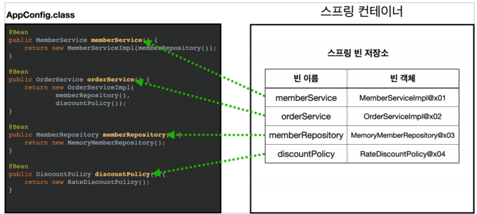
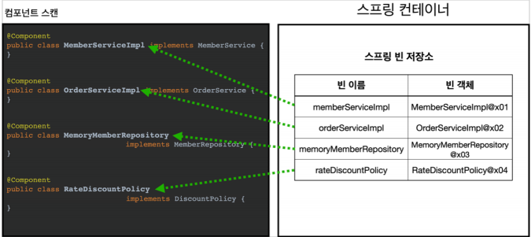

# 의존관계 주입 - 최종간단정리

**참고자료**

해당 내용은 다음 강의를 참고하여 정리하였습니다.


[스프링 핵심 원리 - 기본편](https://www.inflearn.com/course/%EC%8A%A4%ED%94%84%EB%A7%81-%ED%95%B5%EC%8B%AC-%EC%9B%90%EB%A6%AC-%EA%B8%B0%EB%B3%B8%ED%8E%B8/dashboard)


### 의존관계 주입방법 3가지

1. 생성자 주입

- 불변, 필수 필드

2. 수정자 주입

- 변경가능, 선택 필드

3. 필드 주입

- 사용X 
- 테스트코드에서 임시 클래스만들때 가끔


보통 의존관계는 불편, 필수인 경우가 많아서 거의 생존자 주입을 사용하면 된다.


### 스프링 Bean등록법





1. 설정파일

- CGLIB 바이트코드 조작 라이브러리로 변환하여 컴파일
- 이후 변경된 클래스로 스프링 컨테이너에 Bean으로 등록

2. 컴포넌트 스캔

- 현재 클래스 위치부터 하위에 있는 @Component들을 모두 Bean으로 등록
- 의존관계는 @Autowired를 사용하여 주입 (생성자주입을 권장)


이름규칙

- 메서드(설정파일) or 클래스(컴포넌트 스캔)의 이름의 첫 글자만 소문자로 바꾸어 bean으로 등록한다.


### 컴포넌트 스캔 생성자 주입코드

```java
@Component
public class OrderServiceImpl implements OrderService {
    
    private final MemberRepository memberRepository;
    private final DiscountPolicy discountPolicy;
    
    // @AutoWired
    public OrderServiceImpl(MemberRepository memberRepository, DiscountPolicy discountPolicy) {
        this.memberRepository = memberRepository;
        this.discountPolicy = discountPolicy;
    }
}
```


### 컴포넌트 스캔 최종형태, @RequiredArgsConstructor 사용

```java
@Component
@RequiredArgsConstructor
public class OrderServiceImpl implements OrderService {
    
    private final MemberRepository memberRepository;
    private final DiscountPolicy discountPolicy;
    
}
```

- Lombok에서 제공하는 어노테이션
- 위의 기존 코드와 완벽히 일치한다.