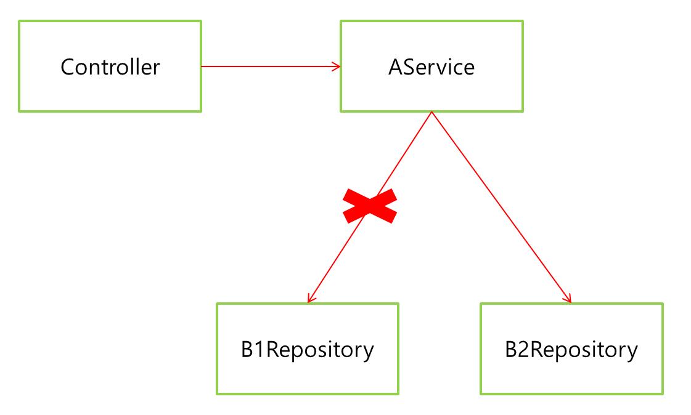

# 의존성 주입 (Dependency Injection)

**참고자료**

해당 내용은 다음 강의를 참고하여 정리하였습니다.


[스프링 핵심 원리 - 기본편](https://www.inflearn.com/course/%EC%8A%A4%ED%94%84%EB%A7%81-%ED%95%B5%EC%8B%AC-%EC%9B%90%EB%A6%AC-%EA%B8%B0%EB%B3%B8%ED%8E%B8/dashboard)


의존성이란?

- 한 객체가 다른 객체를 사용할 때를 말한다.


### 직접 주입

예시1

```java
public class AService {
    public void A_method() {
        // 1. A가 직접 B 인스턴스 만들기
        BInterface b = new B();
        // 2. B 메소드 사용
        b.B_method();
    }
}

public class B1 implements BInterface {
    public void B_method() {
        //...
    }
}
```

A가 직접 B의 인스턴스를 만들어서 사용한다. 

- 강한결합

- 즉 A에 대한 B의 영향력이 커진다. 


예시2.

```java
public class AService {
    public void A_method() {
        if (...){
        	BInterface b1 = new B1();
        } else {
        	BInterface b2 = new B2();
        }
        b.B_method();
    }
}

public class B1 implements BInterface {
    public void B_method() {
        //...
    }
}

public class B2 implements BInterface {
    public void B_method() {
        //...
    }
}
```

- 상황에 따라 B1, B2구현체를 직접 선택해야한다.
  - if-else문으로 나열하여 코드유지보수성이 떨어진다.


### 의존성 주입

생성자 주입

```java
// 구현체1
public class B1Repository implements BRepositoryInterface {
    public void B_method() {
        //...
    }
}
```

```java
// 구현체2
public class B2Repository implements BInterface {
    public void B_method() {
        //...
    }
}
```

```java
// 스프링 빈 관리 파일
@Configuration
public class SpringConfig {
    
    @Bean
    public AService aService() {
        
        // 둘 중 하나 선택
        //return new AService(b1Repository());
        return new AService(b2Repository());
    }
    
    @Bean
    public BInterface b1Repository() {
        return new B1Repository();
    }
    
    @Bean
    public BInterface b2Repository() {
        return new B2Repository();
    }
}
```

```java
// 의존클래스
public class AService {
    
    // 선언 후, 생성자 함수에서 주입받기
    private final BInterface b;
    
    @Autowired
    public void A(BInterface b) {
        this.b = b
    }
    
    //B 메서드 활용
    public void A_method(BInterface b) {
        b.B_method();
    }
    
}
```

- A가 B의 메서드를 써야하는 상황은 똑같다.
- 여기선 외부에서 넣어주는 B구현체를 할당받는다.
  - Component로 관리되는 AService, @Autowired가 붙은 AService의 생성자함수 
    - 해당 필드가 자동으로 주입된다. (스프링 빈에 의해 관리된다)
  - 자동 주입은 Config에서 설정할 수 있다.
    - 빈 등록방법은 컴포넌트 스캔원리, 자바코드직접 빈 등록. 두가지 방법이 있다.

- A와 B클래스의 결합이 느슨해졌다.
- 유지보수가 용이해진다.

그 외에 필드 주입, 세터 주입 등이 있는데 이정도만 알고 넘어가겠다.


그림참조



개방 폐쇄 원칙(OCP)

- 확장에는 열려있고, 변경에는 닫혀있다.

스프링의 DI를 사용하면 기존코드를 변경하지 않고, 설정만으로 구현 클래스를 변경할 수 있다.


