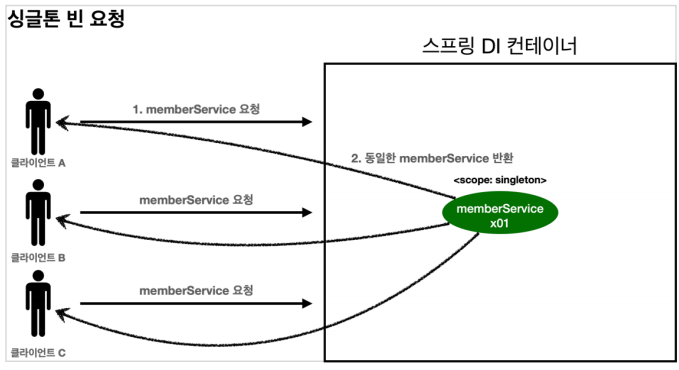
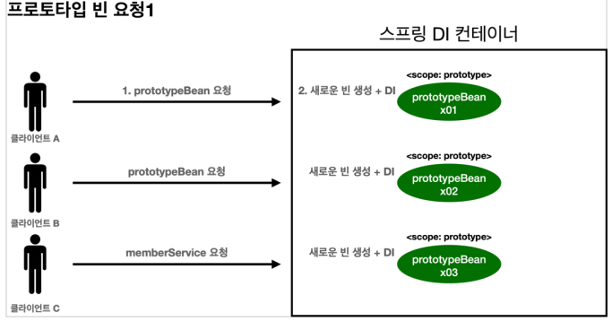

# Bean Scope - 프로토타입 스코프

**참고자료**

해당 내용은 다음 강의를 참고하여 정리하였습니다.

[스프링 핵심 원리 - 기본편](https://www.inflearn.com/course/%EC%8A%A4%ED%94%84%EB%A7%81-%ED%95%B5%EC%8B%AC-%EC%9B%90%EB%A6%AC-%EA%B8%B0%EB%B3%B8%ED%8E%B8/dashboard)

### 싱글톤 vs 프로토타입 스코프

싱글톤 Bean 요청

1. 싱클톤의 Bean을 스프링 컨테이너에 요청
2. 스프링 컨테이너는 본인이 관리하는 스프링 Bean을 반환
3. 이후에 같은 요청이 와도 관리중인 객체 인스턴스의 스프링 Bean을 반환

프로토타입 Bean 요청

1. 프로토타입 스코프의 Bean을 스프링 컨테이너에 요청
2. 스프링 컨테이너는 이 시점에 프로토타입 Bean을 생성, 의존관계주입
3. 생성한 프로토타입 Bean을 반환, (이후 관리 X)
4. 같은 요청이 오면 항상 새로운 프로토타입 Bean을 생성해서 반환

### 프로토 타입 스코프

스프링 컨테이너는 

- 프로토타입 Bean을 생성하고 의존관계주입, 초기화까지만 처리한다.

- 클라이언트에 Bean을 반환하고 더이상 관리하지 않는다.

- 따라서 Bean관리 책임은 프로토타입 Bean을 받은 클라이언트에 있다.
  - EX.) @PreDestroy같은 종료 메서드가 호출되지 않는다.

