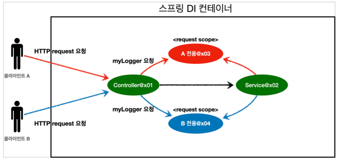

# Bean Scope - 웹 스코프, request

**참고자료**

해당 내용은 다음 강의를 참고하여 정리하였습니다.


[스프링 핵심 원리 - 기본편](https://www.inflearn.com/course/%EC%8A%A4%ED%94%84%EB%A7%81-%ED%95%B5%EC%8B%AC-%EC%9B%90%EB%A6%AC-%EA%B8%B0%EB%B3%B8%ED%8E%B8/dashboard)


### 웹 스코프

특징

- 스프링 Bean의 한 종류

- 웹 환경에서만 동작한다.
- 스프링 컨테이너가 종료시점까지 관리한다.


종류

- request
- session
- application
- websocket


### 웹 스코프 - request 스코프



- HTTP request 요청시, Controller에 가기전에 request scope이 생성된다.

- 이후 Service에서 해당 Bean을 조회시 같은 request scope을 얻을 수 있다.
- 각 요청자마다 다른 request scope이 생성되고 요청처리가 끝나면 종료된다.


### request 스코프의 생명주기에 의한 오류

예제코드

request scope

```java
@Component
@Scope(value = "request")
public class MyLogger {
	
    // ....
    
    @PostConstruct
    public void init() {
        uuid = UUID.randomUUID().toString();
        System.out.println("[" + uuid + "] request scope bean create:" + this);
    }
    
    @PreDestroy
    public void close() {
        System.out.println("[" + uuid + "] request scope bean close:" + this);
    }
}
```

Controller

```java
@Controller
@RequiredArgsConstructor
public class LogDemoController {
    
    private final LogDemoService logDemoService;
    private final MyLogger myLogger;
    
    @RequestMapping("log-demo")
    @ResponseBody
    public String logDemo(HttpServletRequest request) {
        
        String requestURL = request.getRequestURL().toString();
        
        // 문제발생
        myLogger.setRequestURL(requestURL);
        
        myLogger.log("controller test");
        logDemoService.logic("testId");
        return "OK";
        
    }
}
```

- HttpServletRequest으로 requestURL을 받아온다.
- 이를 request scope인 myLogger에 주입해주려고 한다.


문제발생

- 스프링 컨테이너 시작시점에 자동의존관계주입을 처리한다.

  - 그러나 request scope은 request가 들어올때 생성된다.

  - request scope이 없기때문에 LogDemoController에 myLogger을 넣어줄 수 없다.

- 오류발생

  - ```
    Error creating bean with name 'myLogger': Scope 'request' is not active for the current thread; consider defining a scoped proxy for this bean if you intend to refer to it from a singleton;
    ```


### 해결방법 1. Provider 사용

```java
@Component
@Scope(value = "request")
public class MyLogger {
	
    // ....
    
    @PostConstruct
    public void init() {
        uuid = UUID.randomUUID().toString();
        System.out.println("[" + uuid + "] request scope bean create:" + this);
    }
    
    @PreDestroy
    public void close() {
        System.out.println("[" + uuid + "] request scope bean close:" + this);
    }
}
```

```java
@Controller
@RequiredArgsConstructor
public class LogDemoController {
    
    private final LogDemoService logDemoService;
    private final ObjectProvider<MyLogger> myLoggerProvider;
    
    @RequestMapping("log-demo") 
    @ResponseBody
    public String logDemo(HttpServletRequest request) {
        
        String requestURL = request.getRequestURL().toString();
        
        MyLogger myLogger = myLoggerProvider.getObject();
        myLogger.setRequestURL(requestURL);
        
        myLogger.log("controller test");
        logDemoService.logic("testId");
        return "OK";
    }
}
```

- ObjectProvider 덕분에 `ObjectProvider.getObject()` 를 호출하는 시점까지 request scope Bean의 생성을 지연할 수 있다.

- `ObjectProvider.getObject()`를 LogDemoController , LogDemoService 에서 각각 한번씩 따로 호출해도 같은 HTTP 요청이면 같은 스프링 Bean이 반환된다


### 해결방법 2. 프록시 사용

```java
@Component
@Scope(value = "request", proxyMode = ScopedProxyMode.TARGET_CLASS)
public class MyLogger {
    
    // ....
    
    @PostConstruct
    public void init() {
        uuid = UUID.randomUUID().toString();
        System.out.println("[" + uuid + "] request scope bean create:" + this);
    }
    
    @PreDestroy
    public void close() {
        System.out.println("[" + uuid + "] request scope bean close:" + this);
    }
}
```

```java
@Controller
@RequiredArgsConstructor
public class LogDemoController {
    
    private final LogDemoService logDemoService;
    private final MyLogger myLogger;
    
    @RequestMapping("log-demo")
    @ResponseBody
    public String logDemo(HttpServletRequest request) {
        
        String requestURL = request.getRequestURL().toString();
        
        myLogger.setRequestURL(requestURL);
        
        myLogger.log("controller test");
        logDemoService.logic("testId");
        return "OK";
    }
}
```

- @Scope(value = "request", proxyMode = ScopedProxyMode.TARGET_CLASS)

  - CGLIB라는 라이브러리로 내 클래스를 상속 받은 가짜 프록시 객체를 만들어서 주입

  - 스프링 컨테이너에 "myLogger"라는 이름으로 이 가짜 프록시 객체를 등록
    - 의존관계 주입도 이 가짜 프록시 객체가 주입


가짜 프록시 객체

- 요청이 오면 그때 내부에서 진짜 빈을 요청하는 위임 로직이 들어있다.
  - myLogger.logic() 호출하면 가짜 프록시 객체의 메서드를 호출
  - 가짜 프록시 객체는 request 스코프의 진짜 myLogger.logic()를 호출


장점

- 마치 싱글톤 Bean을 사용하듯이 편리하게 request scope를 사용할 수 있다.
- 애노테이션 설정 변경만으로 원본 객체를 프록시 객체로 대체할 수 있다.
  - 다형성과 DI 컨테이너가 가진 큰 강점


주의점

- 싱글톤을 사용하는 것 같지만 다르게 동작하기 때문에 결국 주의해서 사용해야 한다.
- 꼭 필요한 곳에만 최소한으로 사용, 무분별하게 사용하면 유지보수하기 어려워진다.

