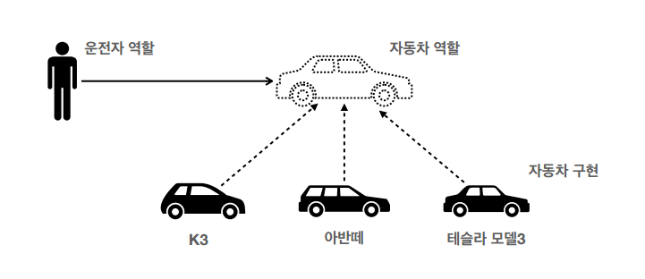
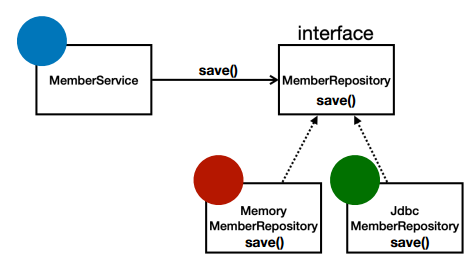

# 객체 지향 프로그래밍

**참고자료**

해당 내용은 다음 강의를 참고하여 정리하였습니다.


[스프링 핵심 원리 - 기본편](https://www.inflearn.com/course/%EC%8A%A4%ED%94%84%EB%A7%81-%ED%95%B5%EC%8B%AC-%EC%9B%90%EB%A6%AC-%EA%B8%B0%EB%B3%B8%ED%8E%B8/dashboard)


객체 지향 프로그래밍이란?

- 추상화된 객체들간의 상호작용을 통해 로직을 구성하는 방법

- 유연하고 변경에 용이한 프로그램 설계
  - 갈아 끼울 수 있다.


### 1️⃣ 다형성

- 하나의 객체가 여러가지 타입을 가짐


역할과 구현으로 세상을 구분한다.


예시1.) 자동차



역할 (인터페이스)

- 자동자

구현 (구현 클래스)

- K3, 아반떼, 테슬라 모델3


예시2.) DB가 정해지지 않았을 때



인터페이스

- MemberRepository

구현 클래스

- MemoryMemberRepository, JdbcMemberRepository


하나의 인터페이스와 여러 구현체를 만들어 넣고 `갈아 끼우`면된다.

```java
public class MemberService {
 private MemberRepository memberRepository = new MemoryMemberRepository();
 //private MemberRepository memberRepository = new JdbcMemberRepository();
}
```

여기서 클라이언트 클래스의 로직이 변경됨을 볼 수 있음

이를 스프링의 DI로 해결할 수 있다.


다형성의 본질

- 구현 클래스를 실행시점에 유연하게 변경할 수 있다.
- 클라이언트를 변경하지 않고 서버구현기능을 유연하게 변경할 수 있다.


다형성을 활용하여 객체지향프로그래밍의 목적을 달성할 수 있다.

- 유연하고 변경용이한 코드

그러나 다형성만으로는 OCP, DIP를 지킬 수 없다.


스프링은 이러한 다형성을 극대화해서 이용하게 해준다.

- IoC, DI 등


### 2️⃣ 좋은 객체 지향 설계의 5가지 원칙 (SOLID)

1. 단일 책임 원칙 (SRP: single responsibility principle)

- 한 클래스는 하나의 책임만 가진다.
  - 변경 되었을 때 파급효과가 적다.


2. 개방 폐쇄 원칙 (OCP: Open/closed principle)

   - 소프트웨어 요소는 확장에는 열려있으나 변경에는 닫혀있다.

     - 다형성 예시 참고
     - 인터페이스의 구현클래스를 추가로 만들어서 확장가능

   - ```java
     public class MemberService {
     	private MemberRepository memberRepository = new MemoryMemberRepository();
      	//private MemberRepository memberRepository = new JdbcMemberRepository();
     }
     ```

     - 클라이언트의 코드를 변경해야하는 상황
     - 다형성을 활용했으나 OCP를 지키지 못함


3. 리스코프 치환 원칙 (LSP: Liskov substitution principle)
   - 하위 클래스는 인터페이스의 규약을 지켜야 한다.
   - 믿음의 문제
     - 엑셀이 뒤로가면?


4. 인터페이스 분리 원칙 (ISP: Interface segregation principle)

- 범용 인터페이스보단 특정 클라이언트를 위한 인터페이스 여러개를 쪼개는게 좋음
  - 자동차 인터페이스 -> 운전 인터페이스, 정비 인터페이스
  - 사용자 클라이언트 -> 운전자 클라이언트, 정비사 클라이언트
- 정비 인터페이스가 변해도 운전자 클라이언트에는 영향을 주지 않음
- 인터페이스가 명확해지고 대체 가능성이 높아짐


5. 의존관계 역전 원칙 (DIP: Dependency inversion principle)

- 추상화에 의존해야지 구체화에 의존하면 안된다.
- 클라이언트는 추상화를 의존하고 거기에 구현클래스를 이것저것 끼워넣는 식
  - Service클래스는 DB 인터페이스에 의존하고, 여기에 MemoryDB나 RDB를 끼워넣음


### 3️⃣ 스프링과 다형성

스프링은 다음의 기술로 다형성+OCP, DIP를 가능하게 지원한다.

- DI(Dependency Injection): 의존성 주입
- DI컨테이너 제공

클라이언트 코드의 변경없이 기능을 확장할 수 있게 해준다.

갈아 끼우듯이 개발가능
