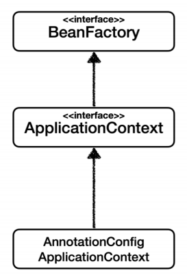
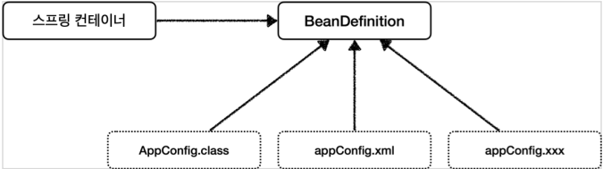
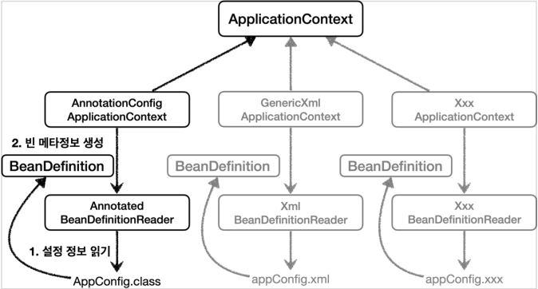

**참고자료**

해당 내용은 다음 강의를 참고하여 정리하였습니다.

[스프링 핵심 원리 - 기본편](https://www.inflearn.com/course/%EC%8A%A4%ED%94%84%EB%A7%81-%ED%95%B5%EC%8B%AC-%EC%9B%90%EB%A6%AC-%EA%B8%B0%EB%B3%B8%ED%8E%B8/dashboard)

### BeanFactory와 ApplicationContext

BeanFactory

- 스프링 컨테이너의 최상위 인터페이스

- 스프링 빈을 관리하고 조회하는 역할

ApplicationContext

- BeanFactory 기능을 모두 상속받아서 제공
- 빈을 관리하고 조회하는 기능 + 수 많은 부가기능
  - 메시지소스를 활용한 국제화 기능, 환경변수, 애플리케이션 이벤트, 편리한 리소스 조회

### 스프링 컨테이너의 다양한 설정 형식 지원 - 자바 코드, XML

- 어떻게 다양한 설정 형식을 지원할 수 있을까?

BeanDefinition

BeanDefinition

- 추상화 개념으로 스프링 컨테이너는 BeanDefinition만 알고 있으면 된다.
  - AnnotationConfigApplicationContext가 AnnotatedBeanDefinitionReader로 AppConfig.class을 읽고 BeanDefinition을 생성
  - GenericXmlApplicationContext가 XmlBeanDefinitionReader 를 사용해서 appConfig.xml를 읽고 BeanDefinition을 생성
  - 새로운 형식의 설정 정보가 추가되면, XxxBeanDefinitionReader를 만들어서 BeanDefinition을 생성

- 빈 설정 메타정보를 담고 있다.
  - @Bean, <bean> 당 각각 하나씩 메타 정보가 생성된다.
  - 스프링 컨테이너는 이 메타정보를 기반으로 bean을 생성한다.

- BeanDefinition이 가지고 있는 메타정보들
  - BeanClassName, factoryBeanName, factoryMethodName, Scope, lazyInit, InitMethodName, DestroyMethodName, Constructor arguments, Properties

