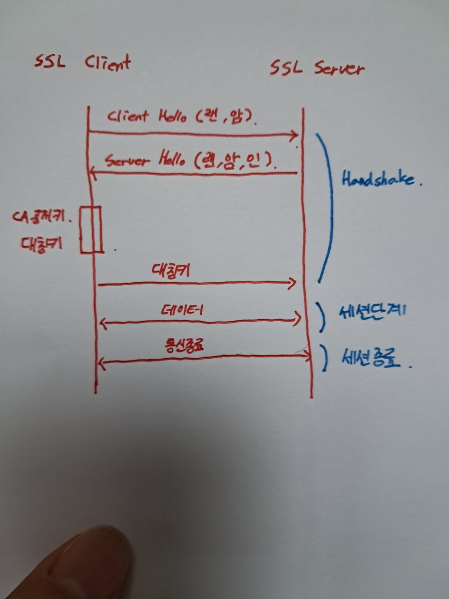

# TLS/SSL

#### 목적

- 인증서 전달

#### 1. HandShake단계

1. Client Hello

   - 랜덤데이터

   - 암호화 방식들

2. Server Hello

   - 랜덤데이터

   - 서버 선택 암호화 방식

   - 인증서

3. 클라이언트

   - CA공개키

   - 대칭키

4. 서버
   - 대칭키

5. HandShake 종료

#### 2. 세션단계

대칭키 방식으로 데이터를 주고 받음

#### 3. 세션종료

SSL 통신 종료

대칭키(세션키) 폐지

