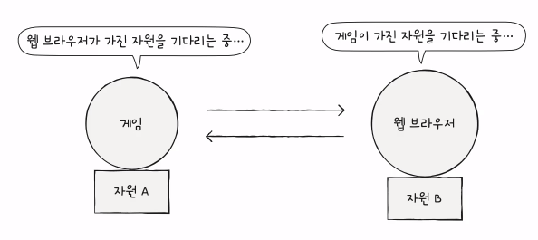
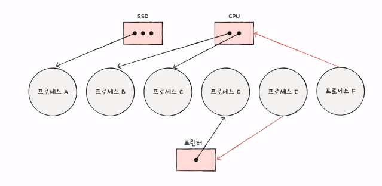
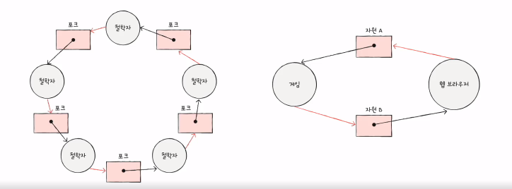
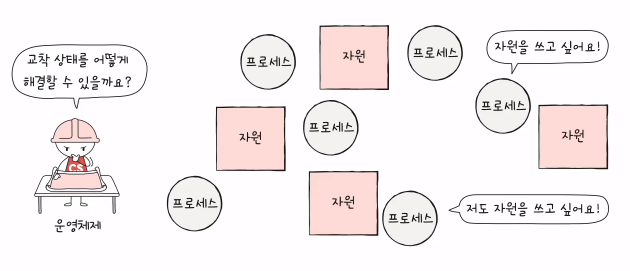
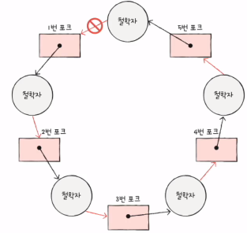
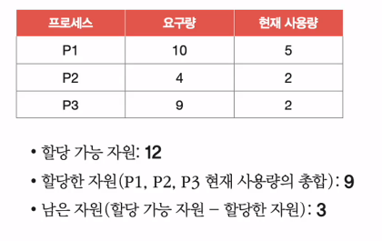

# 교착상태

### 1️⃣ 교착상태란

- 일어나지 않을 사건을 계속해서 기다리며 진행이 멈추는 상태
- 게임, 웹브라우저 둘 다 자원 A, B가 필요한 상태

#### 자원할당그래프

- 교착 상태 발생 조건 파악 가능

- 어떤 프로세스가 어떤 자원을 가지고 있고, 기다리는 중인지 확인 가능

- 원의 형태를 하고 있는 특징

#### 교착상태가 발생할 조건

1. 상호배제: 한 프로세스가 사용하는 자원을 다른 프로세스가 사용할 수 없는 상태
2. 점유와 대기: 자원을 할당 받은 상태에서 다른 자원을 할당받기를 기다리는 상태

3. 비선점: 어떤 프로세스도 다른 프로세스의 자원을 강제로 빼앗지 못하는 상태
4. 원형대기: 프로세스들이 원의 형태로 자원을 대기하는 상태

### 2️⃣ 교착상태 해결 방법

#### 교착상태 예방

- 교착 상태 발생 조건 중 하나를 없애버리기

  1. 상호배제 제거

     - 모든 자원을 공유 가능하게 만든다
     - 현실적으로 불가능

  2. 점유화 대기 제거

     - 특정 프로세스에 자원을 모두 할당 or 아예 할당 X
     - 자원의 활용률을 낮출 수 있는 방식

  3. 비선점 조건 제거

     - 선점이 가능한 자원(e.g. CPU)에 한해 효과적
     - 모든 자원이 선점 가능하진 않음

  4. 원형 대기 조건 제거

     - 

     - 
     - `모든 자원에 번호`를 붙이고 오름차순으로 할당

     - `모든 자원에 번호`를 붙이는 것은 어려운 작업
     - 어떤 자원들에 번호를 붙이냐에 따라 활용률이 달라진다

#### 교착상태 회피

- `무분별한 자원 할당`으로 인해 교착상태가 발생했다고 간주

- 교착 상태가 발생하지 않을 만큼 `조심 조심` 할당하기

- 용어

  - `안전 순서열`: 교착상태 없이 프로세스에 안전하게 자원을 할당할 수 있는 순서

  - `안전 상태`: 안전순서열이 있는 상태

  - `불안전 상태`: 안전순서열이 없는 상태

- 예시
  - 
  - 안전 순서열 = P2 - P1 - P3
  - 불안전 상태 = P3 - P1 - P2
- 항상 안전상태를 유지하도록 자원을 할당하는 방식

#### 교착상태 검출 후 회복

- 프로세스가 자원을 요구하면 `일단 할당`, 교착상태 검출시 `회복`

1. 선점을 통한 회복
   - 교착 상태가 해결될 때까지 한 프로세스씩 자원을 몰아주는 방식

2. 프로세스 강제 종료를 통한 회복
   1. 교착상태 프로세스 모두 강제 종료

     - 작업 내역을 잃는 부작용

   2. 한 프로세스씩 강제 종료

     - `오버헤드`가 일어날 수 있음

     - 오베헤드: 프로세스를 실행하는데 필요한 추가비용