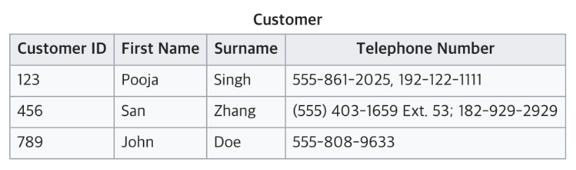
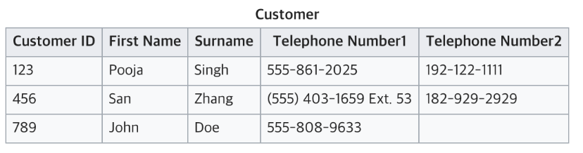
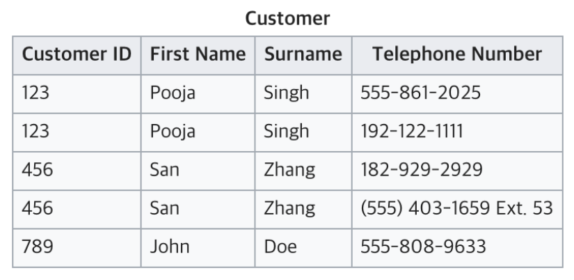
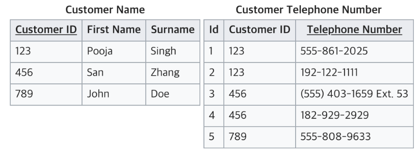
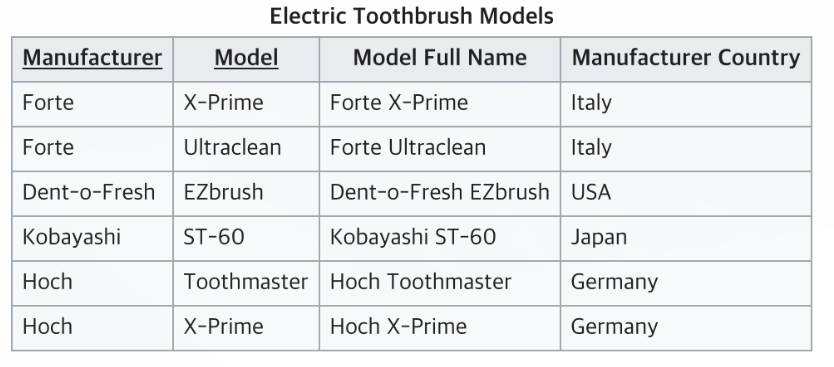
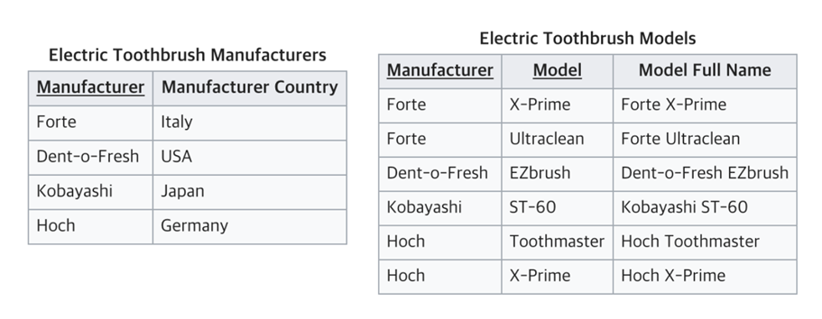
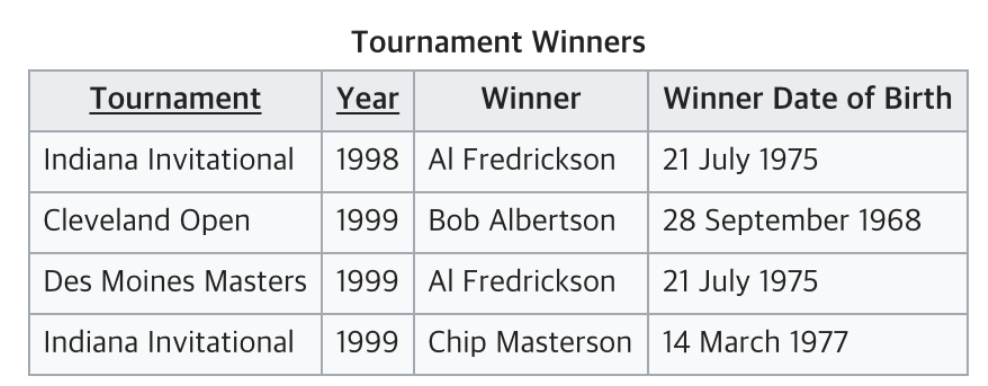
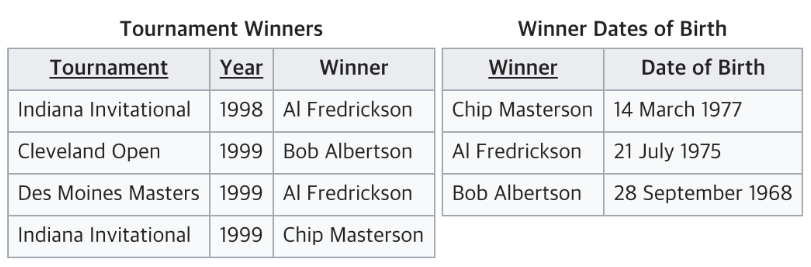

# 데이터베이스 정규화란?

### 정규화란

RDB에서 데이터의 중복을 최소화하고 테이터의 일관성을 유지하기 위한 `데이터 구조화 프로세스`

(데이터의 일관성: 정확하고 유효한 상태 - 규칙,제약조건,관계 등이 일치)

필자는 그냥 `좋은 데이터 구조 설계를 위한 프로세스`라고 이해할 예정
항상 느끼는 거지만 설명들을 정말 어렵게 해놓는거 같다.

좋은 구조란? (정규화의 목적)

- 중복제거
  - 중복이 있으면 데이터 변경,삭제시 `일관성`에 문제가 생김
- 데이터 종속성 해소 (확장성)
  - 데이터의 변경이나 삭제 시 다른 데이터에 영향을 초소화
  - 그러면 식별관계는 정규화 목적 중 데이터 종속성 해소에 위반되는거 아닌가?
- 효율적인 데이터 조작
  - 데이터를 적절한 테이블로 분리하고, 테이블간의 관계를 정의히여, 데이터 조작을 효율적으로 수행
  - 데이터베이스의 성능 향상

- 논리적이고 직관적인 테이블 구성

### 제 1정규화(1NF)

다음의 조건을 만족시켜야 한다.

1. 어떤 릴레이션에 속한 모든 도메인이 원자값만으로 되어 있어야한다.

2. 모든 속성에 반복되는 그룹이 나타나지 않는다(같은 성질을 같는 필드가 2개 이상).

3. 기본키를 사용하여 관련 데이터의 각 집합을 고유하게 식별할 수 있어야 한다.

예제1

1. TelephoneNumber가 원자값으로 구성되어있지 않음
2. 같은 성질을 같는 필드 그룹이 없음
3. CustomerId를 기본키로 Customer 데이터의 각 집합을 고유하게 식별 가능

2,3번 조건은 만족하나 1번은 만족하지 않는다

예제2

1. 모든 필드가 원자값으로 구성되어 있음

2. TelephoneNumber1, TelephoneNumber2 그룹이 반복되는 경우가 발생함
3. CustomerId를 기본키로 Customer 데이터의 각 집합을 고유하게 식별 가능

1,3번 조건은 만족하나 2번은 만족하지 않는다.

예제3

1. 모든 필드가 원자값으로 구성되어 있음
2. 같은 성질을 같는 필드 그룹이 없음
3. CustomerId가 기본키로 Customer 데이터를 고유하게 식별하지 못한다.

1,2번은 만족하나 3번을 만족하지 않음

예제4

Customer테이블을 Customer Name과 Customer Telephone Number로 분리한 상태

1. 모든 필드가 원자값으로 구성되어 있음
2. 같은 성질을 같는 필드 그룹이 없음
3. Customer Name 테이블에선 CustomerId로 Customer Telephone Number테이블에선 Id로 고유한 식별자 존재

제 1정규화 조건들을 모두 만족시켰다.

자료를 찾아보며 느낀점은 제 1정규화 조건만 제시하고 이를 만족시키는 구조는 개발자 개인 역량인 듯하다.

위의 예시에선 1대N의 관계로 테이블을 설계하여 제 1정규화조건들을 만족시켰다.

### 제 2정규화(2NF)

사전지식

1. 함수적 종속: X의 값에 따라 Y값이 결정될 때, Y는 X에 대해 함수적종속이라고 한다.
   EX) 학번을 알면 이름을 알 수 있다. 이름은 학번에 대해 함수적종속이다. (학번->이름)

2. 완전함수종속: {X1, X2}의 값에 따라 Y가 결정될 때 완전함수종속이라고 한다.
3. 부분함수종속: {X1, X2}중 하나의 값에 따라 Y가 결정될 때 부분함수종속이라고 한다.

제 2정규화는 다음의 조건을 만족시켜야한다.

- 테이블의 모든 컬럼은 완전함수종속이여야 한다.

제 2정규화 단계는 다음과 같다.

1. 기본키 식별
2. 비기본키 종속성 확인
3. 부분함수종속성제거, 테이블을 분리하여 구조화

예시

1. 여기서 기본키는 (Manufacturer + Model) 복합키이다.

2. `Model과 Manufacturer 컬럼`을 알면 `Model Full Name컬럼`을 알 수 있다.
   {Model, Manufacturer} -> Model Full Name
   즉 `완전함수종속`이다.

   `Manufacturer컬럼`만 알면 `Manufacturer Country 컬럼`을 알 수 있다.
   즉 `부분함수종속`이다.

3. `Manufacturer`을 기본키로 테이블을 분리하여 `Manufacturer Country`를 `완전함수종속`으로 만든다.

제 2정규화 과정은 1정규화와 다르게 레시피가 있는 듯하다.

### 제 3정규화(3NF)

사전지식

- 이행적 함수 종속성 이란?

속성 간의 종속성이 연쇄적으로 전파되는 현상, 
어떤 필드가 기본 키가 아닌 다른 필드에 종속되는 현상 

EX) 학생테이블 
| 학번       | 학생이름 | 학과       | 담당교수 | 학과장 |
| ---------- | -------- | ---------- | -------- | :----- |
| 2017123123 | 최성민   | 생명공학과 | 아무개   | 무아개 |

담당교수필드와 학과장필드는 학과필드에 종속되어있다.
만약 최성민 학생의 학과가 변경된다면 담당교수와 학과장도 변경되어야 한다.
그렇지 않다면 데이터의 일관성을 훼손할 수 있다.

제 3정규화는 다음의 조건을 만족시켜야한다.

- 이행적 함수 종속성이 없어야 한다.

제 3정규화 단계

1. 기본 키 및 비기본 키 식별
2. 이행적 함수 종속성 확인
3. 이행적 함수 종속성 제거

예시

1. {Tournament, Year}을 복합키로 기본키로 사용한다.
2. `Winner필드`는 기본키에 종속된다.
   `Winner Date of Birth필드`는 `Winner필드`에 종속된다.

3. `Winner필드`를 기본키로 하고 `Date of Birth필드`가 종속된 테이블을 분리한다

### 정리

이 과정을 다 외우는 것은 시간낭비인듯하고, 정규화 1,2,3을 이해할 수 있고, 필요할때 참고하여 RDB를 설계할 수 있으면 될 것같다.