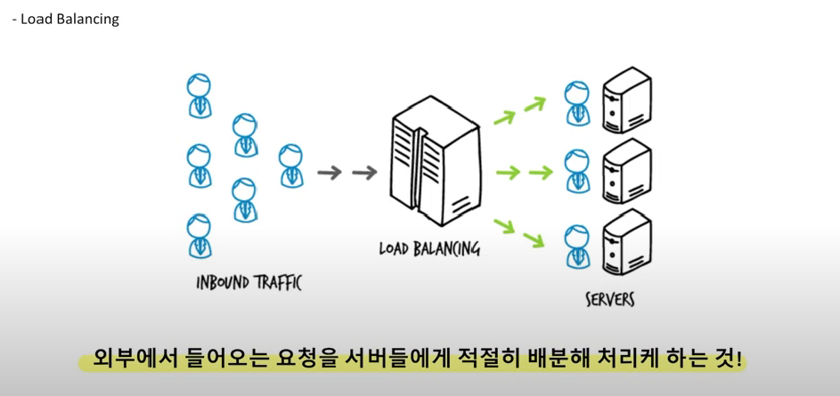
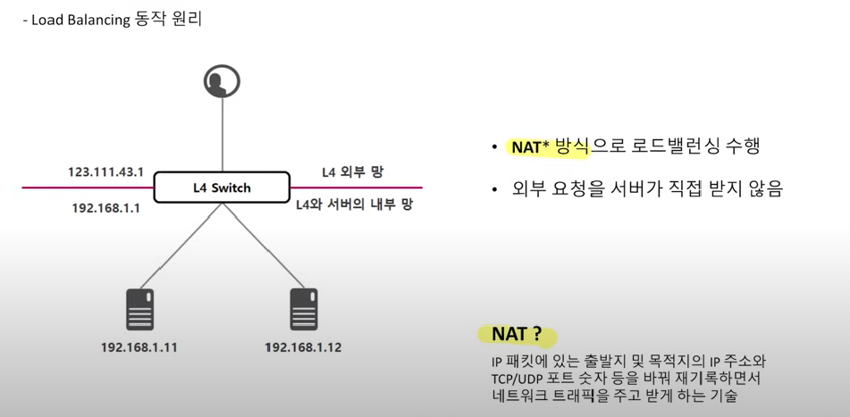

# 로드밸런싱

#### 서버부하해결

- Scale-Up

- Scale-Out
  - 비용, 무중단

#### 로드 밸런싱

- 트래픽 적절히 배분

NAT: "Network Address Translation", 네트워크 주소변환

- IP, 포트번호를 재기록

#### 로드밸런서의 종류

L2: Data link, Mac

L3: Network, IP

L4: Tranport, Port

L7: Application, URL 

#### 로드밸런싱 방법

1. 라운드 로빈(Round Robin) : CPU 스케줄링의 라운드 로빈 방식 활용
2. Least Connection: TCP/IP connection기준
3. Ratio(가중치): Connection/서버성능

#### 로드밸런서 이중화

- 장애대비
- Active, Passive

