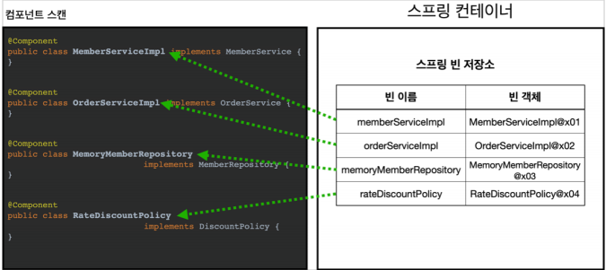
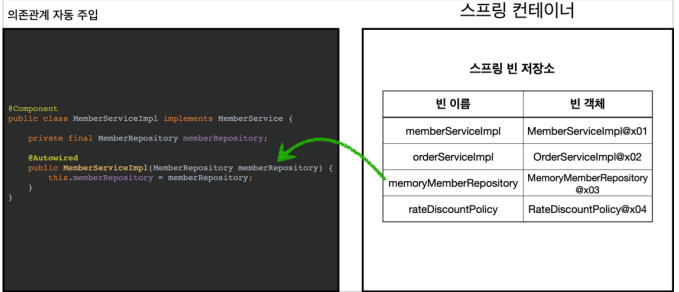
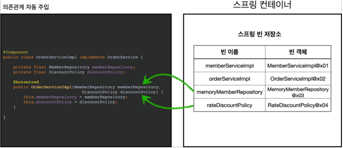

# 컴포넌트 스캔 - Bean 등록

### 설정정보에 @Bean으로 직접 등록하는 방식의 문제점

설정파일

```java
@Configuration
public class AppConfig {
    
    @Bean
    public MemberService memberService() {
        return new MemberServiceImpl(memberRepository());
    }
    
    @Bean
    public OrderService orderService() {
        return new OrderServiceImpl(
            memberRepository(),
            discountPolicy());
    }
    
    // 의존객체
    @Bean public MemberRepository memberRepository() {
        return new MemoryMemberRepository();
    }
}
```

스프링 Bean이 매우 많아지면

- 일일히 등록하기 힘들다.
- 설정정보 코드가 너무 커진다.
- 누락문제 발생위험


### 컴포넌트 스캔으로 Bean 등록

설정파일

```java
package hello.core;

@Configuration
@ComponentScan(
    excludeFilters = @Filter(
        type = FilterType.ANNOTATION,
        classes = Configuration.class
    )
)
public class AutoAppConfig {

}
```

1. @Component Scan



- @Component가 붙은 모든 클래스를 스프링 Bean으로 등록한다.
- Bean 이름 설정
  - 맨 앞글자만 소문자로 바꾸어 Bean으로 저장
  - @Component("memberService2")으로 이름 직접 지정가능

2. @Autowired 의존관계 자동 주입





- 생성자에 @Autowired를 붙여주면
  - 해당 의존성을 스프링 컨테이너가 빈 저장소에서 찾아서 주입한다.
    - 싱글톤을 지켜줌
  - 기본 조회 전략은 타입으로 조회한다.
    - getBean(MemberRepository.class)와 같다고 보면됨
    - 같은형의 타입이 여러개라면 에러가 뜬다.
    - 여기선 MemberRepositoy의 형의 구현클래스가 여러개면 에러가 뜸

