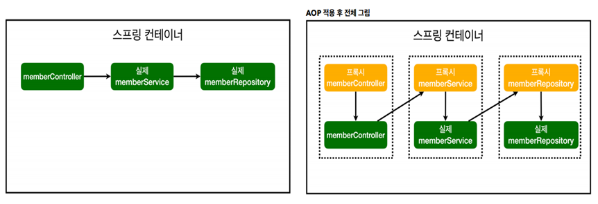

# AOP (Aspect Oriented Programming)

AOP란?

- 관점지향 프로그래밍

- 관점을 두 개로 나눈다
  - 공통관심사항
  - 핵심관심사항

- 두 관점을 기준으로 모듈화하는 것


EX) 공통관심사항: 시간측정

```java
class AClass{
    
    public void A_method(){
        long start = System.currentTimeMillis();

        try{
            // 핵심관심사항

        } finally {
            long finish = System.currentTimeMillis();
            long timeMs = finish - start;
            System.out.println("A_method: " + timeMs + "ms");
        }
        
        
    public void B_method(){
        // ...
    }
        
    //...
}
```

- 시간측정 로직을 모든 메소드에 일일히 코딩한다.
  - 유지보수 어렵다.
  - 시간측정 로직을 변경할 때 모든 로직을 찾아가면서 변경해야한다.


시간측정을 AOP로 분리한 코드

```java
@Configuration
public class SpringConfig {
    
    @Bean
	public TimetraceAop timetraceAop() {
        return new TimetraceAop();
    }
}
```

```java
// @Component (AOP는 자바로 직접 빈 등록하는계 명시적이어서 좋다고 함)
@Aspect
public class TimeTraceAop {
    @Around("execution(* hello.hellospring..*(..))")
    public Object execute(ProceedingJoinPoint joinPoint) throws Throwable {
        long start = System.currentTimeMillis();
        System.out.println("START: " + joinPoint.toString());
        try {
            return joinPoint.proceed();
        } finally {
            long finish = System.currentTimeMillis();
            long timeMs = finish - start;
            System.out.println("END: "+joinPoint.toString()+timeMs+"ms");
        }
    }
}
```

```java
class AClass{
    
    public void A_method(){
        // 핵심관심사항
        }
        
        
    public void B_method(){
        // 핵심관심사항
    }
        
    //...
}
```

- 자세한 로직 설명은 생량
- 시간측정 로직을 별도의 공동 로직으로 분리
- 핵심관심사항만 깔끔하게 유지가능
- 변경이 필요하면 이 로직만 변경하면 됨

- 원하는 적용 대상을 선택할 수 있음


참조 그림 



