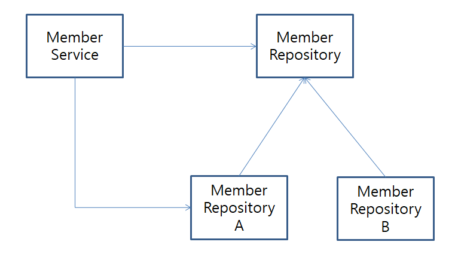

# 스프링의 DI

DI란?

의존성을 외부에서 주입해주는 것을 말한다.


### 0️⃣ 예시 상황

회원정보를 저장하는데 DB가 정해지지 않은 상황


우리는 이를 다형성을 활용하여 MemberRepository 인터페이스를 만들어 놓고 구현클래스(A, B)를 정의할 수 있다.

DB가 정해진 시점에 우리는 적절한 것을 갈아 넣으면 된다.


현재 MemberService가 MemberRepository를 의존하고 있다.

이것을 직접주입하면 어떻게 될까?


### 1️⃣ 직접주입

MemberServiceImpl 구현클래스

```java
package hello.spring.member;

public class MemberServiceImpl implements MemberService{

    private final MemberRepository memberRepository = new A();
    // private final MemberRepository memberRepository = new B();

}
```

인터페이스 MemberRepository

```java
package hello.spring.member;

public interface MemberRepository{
	
    //.. 메서드 선언
}
```

구현체1 A

```java
package hello.spring.member;

public class A implements MemberRepository{
	
    //.. 메서드 구현
}
```

구현체2 MemberRepositoryB

```java
package hello.spring.member;

public class B implements MemberRepository{
	
    //.. 메서드 구현
}
```


위의 코드를 도식화하면



이러한 형태로 어떤 db를 사용할지에 따라 MemberService의 코드를 바꾸어 주어야한다.

다형성을 활용하여 갈아끼워넣기 좋게 잘 설계했지만, 어떤 db를 쓸지에 따라 MemberService객체코드를 변경해야한다.

즉, MemberService가 인터페이스와 구현클레스 모두에 의존하게 된다.


스프링의 DI(의존성 주입)은 이 문제를 해결해준다.


### 2️⃣ 의존성 주입 DI

MemberRepositoy, A, B 인터페이스와 구현클래스 코드는 생략

MemberServiceImpl 구현클래스

```java
package hello.spring.member;

public class MemberServiceImpl implements MemberService{
    
    private final MemberRepository memberRepository;
    
    // 5. MemberServiceImpl객체 생성하고 MemberRepository에 A를 주입
    public MemberServiceImpl(MemberRepository memberRepository) {
        this.memberRepository = memberRepository;
    }
}
```

AppConfig

```java
public class AppConfig {
    
    public MemberService memberService() {
        // 3. 구현클래스A를 생성
        // 4. A를 인자로 하는 MemberServiceImpl의 생성자 함수를 호출
        return new MemberServiceImpl(new A());
        // 6. A를 주입받은 MemberServiceImpl객체를 반환
    }
}
```

MemberApp

```java
public class MemberApp {
    public static void main(String[] args) {
        
        // 1. AppConfig 인스턴스 생성
        AppConfig appConfig = new AppConfig();
        
        // 2. appConfig의 memberService 메서드를 호출
        MemberService memberService = appConfig.memberService();
        // 7. A를 주입받은 MemberServiceImpl객체를 memberService에 저장
        
 }
}
```

나중에 위 설명을 볼때는 이해가 잘 안될것 같다.

코드에 화살표를 그려보며 여러번 그려봐야할듯


쨌든 이렇게 하면 DB가 바뀌더라고 MemberServiceImpl의 코드를 변경해주지 않아도 된다.

의존성 주입 역할을 분리했기 때문이다.

- 기존 MemberServiceImpl에서 의존성을 직접 주입하는 역할, 서비스로직 역할을 맡음
- 의존성을 주입하는 역할을 AppConfig에 분리
- AppConfig에서 DB A를 생성하여 이를 MemberServiceImpl에 넣어줌 (의존성 주입)
- MemberServiceImpl는 
  - AppConfig가 할당해 주는 대로 의존객체를 사용
  - 의존객체의 배역이 누가 들어오던지 신경쓰지 않음
  - db 인터페이스의 기능 자체에만 신경을 쓰고 이를 활용
  - 서비스로직 역할에만 집중


의존성 주입을 통해서

- 단일책임 원칙 (SRP) : 한 클래스는 하나의 책임만 가져야 한다.
- 의존관계역전 원칙(DIP) : 프로그래머는 추상화에 의존하고 구체화에 의존해선 않된다.
- 개방폐쇄 원칙(OCP) : 소프트웨어 요소는 확장에는 열려있으나 변경에는 닫혀있다.

의 원칙들을 지킬 수 있다.


### 3️⃣ Config파일 리팩토링

기존코드

```java
public class AppConfig {
    
    public MemberService memberService() {
        return new MemberServiceImpl(new A());
    }
    
    // 예시 메서드 삽입
    public ExService exService() {
        return new ExServiceImpl(new A());
    }
}
```

1. A에 의존하는 메서드가 merberService외에 여러개가 있다면?
   - A메서드 명이 C로 바뀔때, `new A()`를 모두 `new C()`로 바꿔줘야함

2. 어떤 구현클래스를 쓰는지 명확하게 보기 어렵다


바꾼코드

```java
public class AppConfig {
    
    public MemberService memberService() {
            return new MemberServiceImpl(memberRepository());
    }
    
    public MemberRepository memberRepository(){
        return new A();
    }
    
    public ExService exService() {
        return new ExServiceImpl(memberRepository());
    }
}
```

1. DB선택이 A에서 B로 바뀌어도 memberRepository만 수정하면 된다.

2. 어떤 구현클래스를 사용하는지 빠르게 파악할 수 있다.


### 4️⃣ Config파일 bean 등록

AppConfig파일

```java
@Configuration
public class AppConfig {
    
    @Bean
    public MemberService memberService() {
            return new MemberServiceImpl(memberRepository());
    }
    
    @Bean
    public MemberRepository memberRepository(){
        return new A();
    }
    
    @Bean
    public ExService exService() {
        return new ExServiceImpl(memberRepository());
    }
}
```

AppConfig를 스프링 컨테이너에 넣음

스프링 컨테이너는 @Configuration 붙은 클래스를 설정정보로 사용

- 여기서 @Bean이라 적힌 메서드는 모두 호출
- 메서드 반환 객체를 스프링 컨테이너에 등록 (MemberServiceImpl(A), A, exService(A))
- 이때 메서드 명을 스프링 빈의 이름으로 사용 (memberService, memberRepository, exService)

스프링 컨테이너에서 빈은 `applicationContext.getBean()` 메서드를 통해 찾을 수 있음


MemberApp 실행파일

```java
public class MemberApp {
    
    public static void main(String[] args) {
        
        // 이전코드
        // AppConfig appConfig = new AppConfig();
        // MemberService memberService = appConfig.memberService();
        
        // 스프링 컨테이너에서 빈을 찾는법
        ApplicationContext aC = new AnnotationConfigApplicationContext(AppConfig.class);
        MemberService memberService = aC.getBean("memberService", MemberService.class);

    }
}.
```

기존에는 `AppConfig`를 통해 개발자가 직접 객체를 생성하고 DI를 했다.

이제부턴 스프링 컨테이너에서 객체를 빈으로 등록하고, 스프링 컨테이너에서 빈을 찾아서 사용한다.

이렇게 스프링 컨테이너를 사용하면 많은 이점이 있다고 한다.


### 5️⃣ 결론

MemberService의 의존성을 직접주입이 아닌 AppConfig를 통하여 주입하였다.

- AppConfig에서 해당 인터페이스의 구현클래스를 골라서 넣어준다.
- MemberService의 코드는 이에 상관없이 로직에만 집중할 수 있다.


DI는 

- 의존관계를 주입하는 역할을 따로 분리하고
- 외부에서 의존관계를 주입하게하고

- 객체가 자신의 역할에만 집중할 수 있도록 한다.


DI를 통해 설정역할을 담당하는 외부 클래스를 스프링 컨테이너로 관리하면

많은 이점이 있다고 한다.

