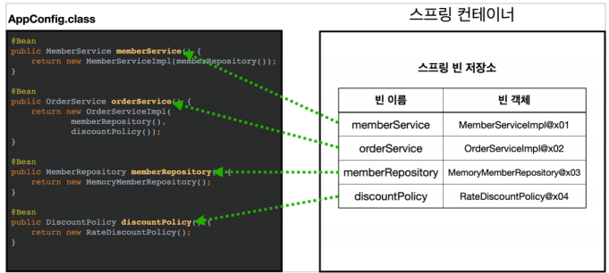

# 스프링 컨테이너 생성과 조회

스프링 컨테이너란?

빈으로 등록된 객체의 생명주기를 관리하고 추가적인 기능을 제공하는 스프링 프레임워크의 핵심 컴포넌트


### 1️⃣ 스프링 컨테이너 생성

```java
ApplicationContext ac = new AnnotationConfigApplicationContext(AppConfig.class);
```

ApplicationContext

- 스프링 컨테이너, 인터페이스
- Java코드, Xml 등을 통해서 빈 객체를 넣을 수 있다.

AnnotationConfigApplicationContext

- 스프링 컨테이너 구현체, 자바설정클래스를 컨테이너에 넣음
  - XML로도 스프링 컨테이너를 만들 수 있다고 함
- AppConfig를 넣어서 만든 컨테이너

ac

- 스프링 컨테이너 인스턴스
- 이것을 통하여 빈으로 관리되는 객체를에 접근할 수 있음


그림설명



AppConfig의 @Bean어노테이션이 붙은 매서드들은 모두 빈으로 등록된다.

- 빈 이름은 매서드의 이름을 사용한다.
- 빈 이름을 직접 부여할 수 있다.
  - @Bean(name="memberService2")


### 2️⃣ 컨테이너에 등록된 모든 빈 조회

ac는 스프링 컨테이너 인스턴스

컨테이너에 접근하는 방법을 크게만 알아볼 예정

자세한 구현 코드는 인터넷을 찾아보면 될 것 같다.


#### ac.getBeanDefinitionNames();

1. 스프링 컨테이너의 모든 Beans 조회

````java
String[] beanDefinitionNames = ac.getBeanDefinitionNames();
````

- 내가 등록한 것 포함해서 스프링의 모든 빈들을 출력


2. 사용자 등록 bean만 조회

```java
String[] beanDefinitionNames = ac.getBeanDefinitionNames();


// 대충 for문
	// BeanDefinition beanDefinition = ac.getBeanDefinition(대충 for문에서 꺼낸 빈 한개)
	//
	// if (beanDefinition.getRole() == BeanDefinition.ROLE_APPLICATION{
	// 	대충 프린트
	//}
// }
```

- BeanDefinition
  - 빈의 메타정보 인터페이스
    - 스프링 컨테이너가 이를 의존하여 스프링 빈을 구성
    - 자바코드나 Xml코드가 구현체 
- 등록된 모든 빈에서 직접 등록한 애플리케이션 빈만 출력
  - ROLE_APPLICATION: 직접 등록한 애플리케이션 빈
  - ROLE_INFRASTRUCTURE: 스프링이 내부에서 사용하는 빈


### 3️⃣ 컨테이너에 등록된 특정 빈 조회

#### ac.getBean("빈 이름", 타입);

1. 빈 이름으로 조회 

```java
MemberService memberService = ac.getBean("memberService", MemberService.class);
```

- ac.getBean("빈 이름", 타입)


2. 빈 타입으로만 조회

```java
MemberService memberService = ac.getBean(MemberService.class);
```

- ac.getBean(타입)


#### ac.getBeansOfType("타입")

1. 특정 타입을 모두 조회

```java
Map<String, MemberRepository> beansOfType = ac.getBeansOfType(MemberRepository.class);
```

- for문 돌려서 bean들 하나하나 확인 가능


### 4️⃣ 스프링의 빈 조회 - 상속관계

부모 타입을 조회하면 자식타입도 함께 조회한다.

최고 부모인 Object 타입으로 조회하면, 모든 스프링 빈을 조회한다.


