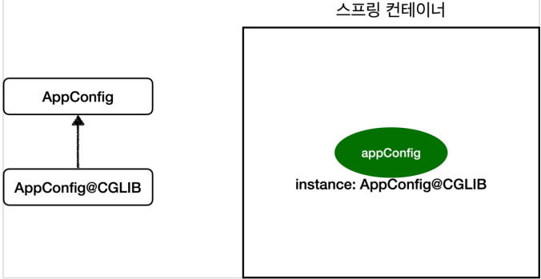

# @Configuration과 싱글톤

### 서론

java 빈 설정 코드

```java
@Configuration
public class AppConfig {
    
    @Bean
    public MemberService memberService() {
        return new MemberServiceImpl(memberRepository());
    }
    
    @Bean
    public OrderService orderService() {
        return new OrderServiceImpl(
            memberRepository(),
            discountPolicy());
    }
    
    // 의존객체
    @Bean public MemberRepository memberRepository() {
        return new MemoryMemberRepository();
    }
}
```

다음은 의존성을 주입하는 역할을 AppConfig.class로 분리해놓은 코드이다.

1. MemberService와 OrderService는 MemberRepository를 의존하고 있다.

2. 이들을 @Bean 어노테이션으로 스프링 컨테이너 빈으로 등록한다.


여기서 드는 의문점

ServiceA와 ServiceB는 AppConfig.Repository()메서드를 호출하여 MemberRepository에 대한 의존성을 MemoryMemberRepository로 (생성자)주입 받는데

그럼 Repository()메서드가 호출될 때마다 MemoryMemberRepository 인스턴스가 생성되는 것인가?


정답은 NO

```java
public class ConfigurationSingletonTest {
    @Test
    void configurationTest() {
        ApplicationContext ac = new AnnotationConfigApplicationContext(AppConfig.class);
        
        MemberServiceImpl memberService = ac.getBean("memberService", MemberServiceImpl.class);
        OrderServiceImpl orderService = ac.getBean("orderService", OrderServiceImpl.class);
        MemberRepository memberRepository = ac.getBean("memberRepository", MemberRepository.class);
        
        //모두 같은 인스턴스를 참고하고 있다.
        System.out.println(memberService.getMemberRepository());
        System.out.println(orderService.getMemberRepository());
        System.out.println(memberRepository);

        assertThat(memberService.getMemberRepository()).isSameAs(memberRepository);
        assertThat(orderService.getMemberRepository()).isSameAs(memberRepository);
    }
}
```

테스트 코드를 돌려보면 3개의 memberRepository값이 같은 인스턴스임을 알 수 있다.

어떻게 이게 가능한 것인가?


### @Configuration과 바이트코드 조작



AppConfig@CGLIB 예상 코드

```java

@Bean
public MemberRepository memberRepository() {
 
	if (memoryMemberRepository가 이미 스프링 컨테이너에 등록되어 있으면?) {
    	return 스프링 컨테이너에서 찾아서 반환;
        
	} else { //스프링 컨테이너에 없으면
        기존 로직을 호출해서 MemoryMemberRepository를 생성하고 스프링 컨테이너에 등록
        return 반환
    }
}
```

스프링 컨테이너는 

- @Configuration이 붙은 AppConfig.class를 CGLIB라는 바이트코드 조작 라이브러리를 사용해서
- AppConfig.class를 상속받은 임의의 다른 클래스를 만들고, 그 다른 클래스를 스프링 빈으로 등록한다.

AppConfig@CGLIB 예상 코드

- AppConfig@CGLIB 코드의 빈이 스프링 컨테이너에 등록되어있으면 반환
- 없으면 기존의 해당 메서드을 호출하여 생성하고 이를 컨테이너에 등록 후 반환

이 방법으로 싱글톤을 보장한다.


### 만약 @Configuration을 달지 않으면?

```java
public class AppConfig {
    
    @Bean
    public MemberService memberService() {
        return new MemberServiceImpl(memberRepository());
    }
    
    @Bean
    public OrderService orderService() {
        return new OrderServiceImpl(
            memberRepository(),
            discountPolicy());
    }
    
    // 의존객체
    @Bean public MemberRepository memberRepository() {
        return new MemoryMemberRepository();
    }
}
```

해당 AppConfig.class는 AppConfig@CGLIB으로 전환되지 않으며 MemoryMemberRepository가 3번 생성되어 싱글톤이 보장되지 않는다.


### 정리

간단하게 @Configuration은 AppConfig.class를 싱글톤이 보장되는 다른 클래스로 변형시켜 빈으로 등록해준다.

@Bean만 사용해도 스프링 빈으로 등록되지만, 싱글톤을 보장하지 않는다.

스프링 설정 정보는 항상 @Configuration 을 사용하자.