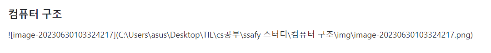
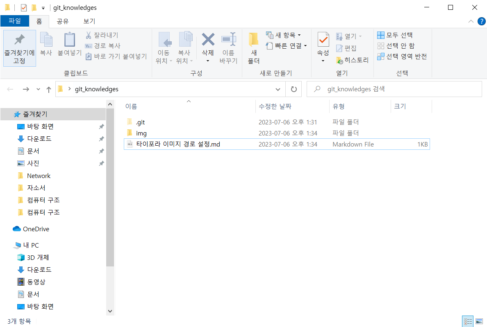
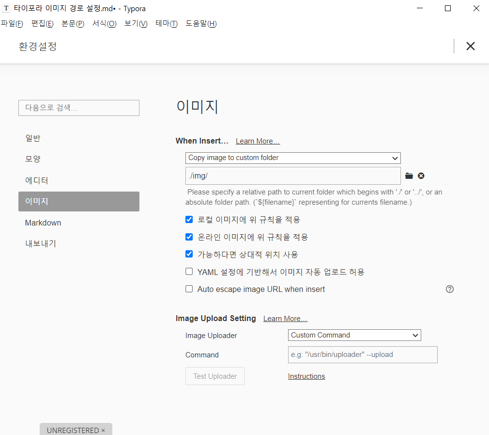

# 원격저장소 이미지 업로드

### 0️⃣ 문제상황



로컬에서 뜨는 이미지가 원격저장소(Github)에서는 뜨지 않는 문제 발생

Typora와 github를 예시로 들어 로컬의 마크다운 이미지 파일을 원격저장소에 온전하게 올리는 방법을 알아보자

1. 로컬에서 이미지를 상대 경로로 저장하기

2. 원격저장소에 마크다운 파일 push하기


### 1️⃣ 해결방법

이미지 경로를 상대경로로 저장하기

1. 같은 폴더 내부에 img폴더를 추가한다



2. 환경설정>이미지에서 이미지 경로를 custom folder로 선택하고 [./img/]처럼 상대경로 형식으로 설정한다



3. 이미지를 Typora에서 붙여넣으면 다음과 같이 이미지 경로가 설정된다

```

```

4. Github에 push하면 마찬가지로 이미지가 상대경로로 입력되어 원격저장소에서도 이미지를 온전히 볼 수 있다


### 2️⃣ 피드백

마크다운 파일에서 이미지를 원격저장소에 push하기 위해서 상대경로 지정방식으로 문제를 해결하였다

하지만 이것은 하나의 방법일 뿐 더 좋은 방법을 찾는다면 다른방법으로 해결해도 괜찮을 것 같다

장점

- 상대경로로 저장되기 때문에 원격저장소에 올리더라도 이미지를 찾을 수 있다

단점

- img폴더에 불필요한 이미지들도 저장되어 리소스가 낭비된다
- 해당 이미지의 이름이 난수로 표현되어 이미지에 적절한 이름이 설정되지 않는다
- 경로가 img폴더에 의존하므로 디렉토리 변경시...어지럽다

