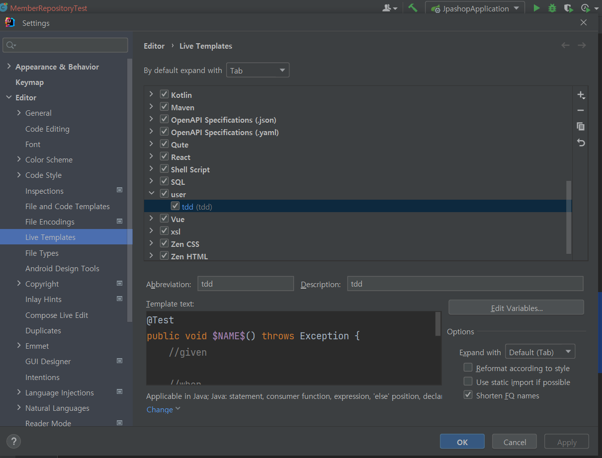

# 인텔리제이 커스텀 단축키 만들기

### Settings -> Live templates -> + 




언어선택 후 단축키와 원하는 코드를 매핑한다.

단축키 tdd

```java
@Test
public void $NAME$() throws Exception {
    //given
    
    //when
    
    //then
}
```

