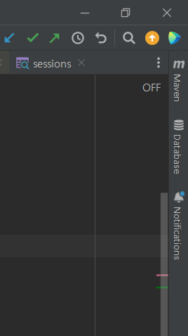
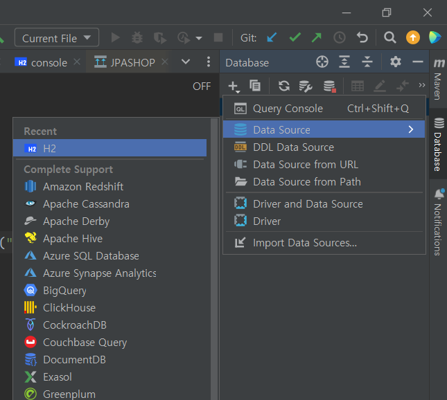
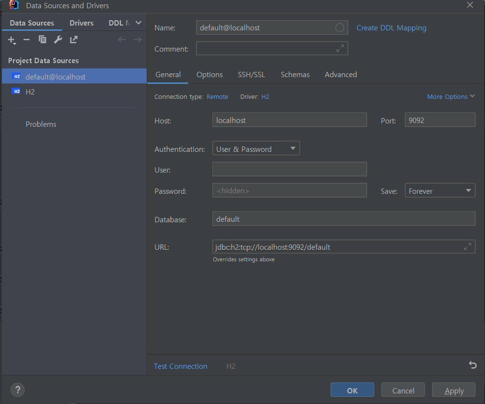
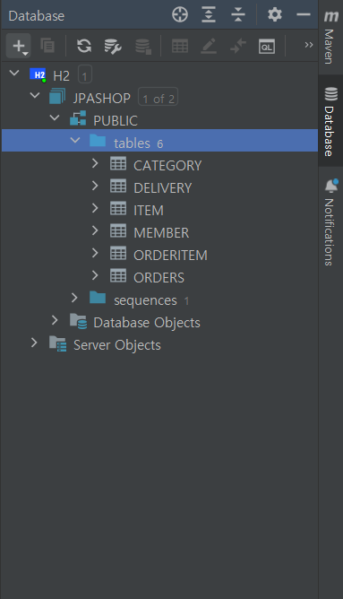

# 인텔리제이에서 EDD 보는법

JPA Entity를 활용하여 볼려고 했으나 설명대로 잘 되지 않았다.

https://devlog-wjdrbs96.tistory.com/425

그래서 어쩔수 없이 인텔리제이를 H2 데이터베이스에 연결해서, ERD를 볼 수 있었다.

인텔리제이의 오른쪽 상단을 보면 Database탭을 볼수 있다.

클릭 이후 "+"버튼에 Data Source탭에서 사용하는 DB를 선택한다.

이후 User와 Password를 입력하고, URL을 설정하면 된다.

다음 tables 우클릭 후 Diagrams > Show Diagram을 클릭하면 끝