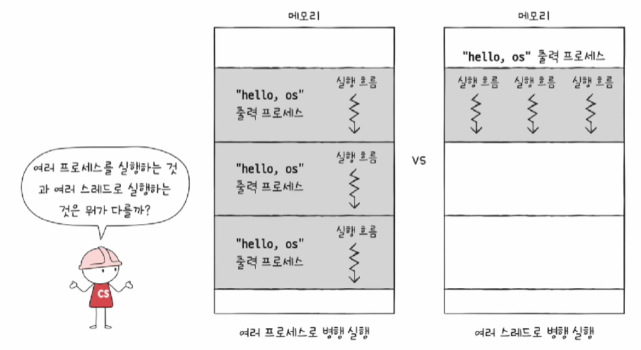

# 프로세스와 스레드

### 1️⃣ 프로세스 개요

#### 들어가며


- 보조기억장치에 프로그램이 저장되어 있는데
- 이 프로그램이 실행중일때 "프로세스"라고 한다
- 윈도우 작업관리자, 리눅스나 macOS의 ps명령어로 프로세스 직접 확인 가능


#### 프로세스의 종류

1. 포그라운드 프로세스
   - 사용자가 볼 수 있는 공간에서 실행되는 프로세스
   - 메모장, 브라우저 등
2. 백그라운드 프로세스
   - 사용자가 볼 수 없는 공간에서 실행되는 프로세스
     - 사용자와 직접 상호작용이 가능한 백그라운드 프로세스
     - 상호작용하지않고 정해진 일만 하는 프로세스; 데몬, 서비스
       - 윈도우 작업관리자>서비스 탭에서 확인가능


#### 프로세스 제어블록 (PCB)

서론


- 모든 프로세스는 CPU가 필요하지만 CPU자원은 한정되어있다
- 프로세스들은 돌아가며 한정된 시간 만큼만 CPU를 이용한다
  - 자신의 차례에 정해진 시간만큼 CPU 이용
  - 타이머 인터럽트가 발생하면 차례 양보
- 이를 위한 자료구조가 프로세스 제어블록 (PCB)


프로세스 제어블록


- 프로세스 생성 시 커널영역에 생성, 종료시 폐기
- 프로세스 관련 정보를 저장하는 자료구조로 옷 태그와 비슷하다

- 운영체제는 이 PCB를 보고 일목오연하게 프로세스들을 관리한다


PCB에 담기는 대표적인 정보

- 운영체제마다 차이는 있지만 대표적으로 아래와 같은 정보들이 PCB에 담긴다

- 프로세스ID (PID)
  - 특정 프로세스의 식별자
  - 윈도우 작업관리자에서 PID확인 가능
- 레지스터 값
  - 
  - 프로세스는 자신의 실행 차례가 오면 이전까지의 사용한 레지스터 중간값을 모두 복원한다
  - 프로그램 카운터, 스택포인터 등
- 프로세스 상태
  - 다음 강의에서 자세히
  - 현재 프로세스의 상태를 나타낸다
    - 입출력 장치를 사용하기 위해 기다리는 상태, CPU 사용을 기다리는 상태 등 
- CPU스케줄링 정보
  - 프로세스가 언제, 어떤 순서로 CPU를 할당 받을지에 대한 정보
- 메모리 정보
  - 프로세스가 어느 주소에 저장되어 있는지에 대한 정보
  - 페이지 테이블 정보
    - 지금으로서는 "메모리의 현재 주소를 알 수 있는 정보"정도로만 이해
    - 중요한 개념으로 이후에 설명
- 사용한 파일과 입출력장치 정보
  - 할당된 입출력 장치
  - 사용 중인 파일 정보


#### 문맥 교환 (context switch)

프로세스 A에서 프로세스 B로 실행순서가 넘어가는 상황 가정


- 기존 프로세스 A는 지금까지의 중간 정보를 백업

  - 프로그램 카운터, 각종 레지스터 값, 메모리 정보, 열었던 파일, 사용한 입출력 장치 등

  - 이러한 중간정보 ==  문맥 (context)
  - 다음 차례가 왔을 때 실행을 재개하기 위한 정보
  - 실행 문맥을 백업해두면 언제든 해당 프로세스의 실행을 재개할 수 있다

- 뒤이어 실행할 프로세스 B의 문맥을 복구
  - 자연스럽게 실행 중인 프로세스가 바뀐다


이처럼 기존의 실행중인 프로세스 문맥을 백업하고 새로운 프로세스의 문맥을 복구하는 과정을 문맥교환 (Context Switching)이라고 한다


- 여러 프로세스가 끊임없이 빠르게 번갈아 가며 실행되는 원리


#### 프로세스의 메모리 영역

메모리의 커널영역엔 PCB가 태그처럼 특정 프로세스의 정보가 담긴다

그렇다면 사용자 영역에선 프로세스가 어떤 식으로 저장이 될까?


#### 프로세스의 사용자 영역


- 대표적으로 아래와 같은 영역들이 존재한다

1. 코드영역 (텍스트 영역)

   - 기계어로 이루어진 명령어가 저장

   - 데이터가 아닌 CPU가 실행할 명령어가 담기기에 쓰기가 금지된 영역

2. 데이터영역

   - 프로그램이 실행되는 동안 유지할 데이터를 저장

   - ex) 전역변수

3. 힙 영역

   - 프로그래머가 직접 할당할 수 있는 저장공간

   - 언젠가는 힙영역에 할당한 메모리 공간을 반환해야하는데
     - 그렇지 않으면 메모리 낭비 "메모리 누수"가 생긴다
     - 이것을 프로그래밍 언어가 알아서 해주기도 하는데 이것을 "가비지 컬렉션"이라고 한다

4. 스택 영역

   - 데이터가 일시적으로 저장되는 공간

   - 잠깐 쓰다가 말 값들이 저장되는 공간

   - e.g. 매개변수, 지역변수

- 1,2는 정적할당영역, 3,4는 동적할당영역이다


#### 힙 영역과 스택영역의 크기는 가변적이다


- 일반적으로 힙 영역은 낮은 주소에서
- 스택영역은 높은 주소에서 메모리를 할당한다


### 2️⃣ 프로세스 상태와 계층 구조

#### 들어가며


- PCB에 기록되는 다양한 프로세스의 상태


#### 프로세스의 상태


- 대부분의 운영체제는 위의 프로세스 상태를 따른다

1. 생성상태
   - 이제 막 메모리에 적재되어 PCB를 할당받은 상태
   - 준비가 완료되었다면 준비상태로
2. 준비상태
   - CPU를 할당 받아 실행할 수 있지만
   - 자신의 차례가 아니기에 기다리는 상태
   - 자신의 차례가 된다면 실행 상태로 (=디스패치)

3. 실행상태
   - CPU를 할당받아 실행 중인 상태
   - 할단된 시간을 모두 사용시(타이머 인터럽트가 발생 시) 준비상태로
   - 실행 도중 입출력장치를 사용하면 입출력 작업이 끝날 때까지 대기 상태로

4. 대기상태
   - 프로세서가 실행 도중 입출력장치를 사용하는 경우
   - 입출력 작업은 CPU에 비해 느리기에 이 경우 대기상태로 접어듬
   - 입출력 작업이 끝나면 (입출력 완료 인터럽트를 받으면) 준비상태로

5. 종료상태
   - 프로세스가 종료된 상태
   - PCB폐기, 프로세스의 메모리 영역 정리


#### 프로세스 계층 구조

윈도우는 프로세스를 계층구조로 관리하지 않지만 알아야 하는 개념

보통 개발자들은 리눅스, macOS를 주로 사용하기 때문


- 프로세스 실행 도중에 (시스템 호출을 통해) 다른 프로세스를 생성할 수 있다
  - 부모 프로세스: 새 프로세스를 형성한 프로세스
  - 자식 프로세스: 부모 프로세스에 의해 생성된 프로세스
  - 부모, 자식 프로세스는 별개의 프로세스로 서로 다른 PID를 가진다 

- pstree라는 명령어를 통해 리눅스, macOS의 프로세스 계층구조를 확인할 수 있다
  - 최초의 프로세스: 컴퓨터가 부팅될때 실행되는 최초의 프로세스
  - 이후 계층구조에 따라 데몬프로세스, 로그인프로세스 등 자식프로세스들이 생겨난다


#### 프로세스 생성 기법

부모 프로세스는 자식 프로세서를 어떻게 만들어 내고

자식 프로세스는 어떻게 자신만의 코드를 실행하는가?


1. fork 시스템 호출
   - 부모 프로세스의 복사본을 생성
   -  부모 프로세스의 자원 상속
2. exec 시스템 호출
   - 메모리 공간을 새로운 프로그램으로 덮어쓰기
   - 코드/데이터 영역은 실행할 프로그램 내용으로 바뀌고 나머지 영역은 초기화


### 3️⃣ 스레드 (소프트웨어)

#### 들어가며


- 스레드(thread)는 프로세스를 구성하는 실행흐름의 단위

- 실행 흐름이 여러개인 프로세스를 "멀티 스레드 프로세스"라고 한다
  - 프로세스를 이루는 여러 명령어를 동시 실행가능


#### 스레드의 구성요소


- 스레드ID, 프로그램 카운터를 비롯한 레지스터 값, 스택 등
  - 실행에 필요한 최소한의 정보를 가짐
  - 한 프로세스의 여러 스레드를 동시에 실행할 수 있게 한다
- 프로세스를 이루는 모든 스레드들은 그 프로세스의 자원을 공유할 수 있다


참고: 리눅스 운영체제에서는 프로세스와 스레드 개념을 잘 구분하진 않는다

- task라는 용어를 사용

- 실제로도 요즘 운영체제에서는 CPU에 실행작업을 전달할때 프로세스가 아닌 스레드단위로 전달함


- 요즘 운영체제에서는 스레드 단위로 CPU를 할당받으며 사용됨
  - 전공서적에서는 프로세스단위로 CPU를 할당받는다고 되어있지만 실제론 이런 경우가 많다고 함


#### 멀티 프로세스와 멀티 스레드




- 동일한 작업을 하는 단일 스레드 프로세스 3개  vs 하나의 프로세스를 여러 스레드로 실행

  - 멀티 프로세스

    - 
    - 프로세스를 fork하면 코드/데이터/힙 영역 등 모든 자원이 복제되어 저장된다
    - 동일한 프로세스 여러 개가 통째로 메모리에 적재

  - 멀티 스레드

    - 

    - 스레드들은 각기 다른 스레드 ID를 가진다(별도의 실행을 위해서)
    - 프로그램 카운터 값을 포함한 레지스터 값, 스택을 가질뿐
    - 프로세스가 가지는 자원을 공유한다

  - 정리
    - 프로세스끼리는 자원을 공유하지 않는다 -> 남남처럼 독립적으로 실행
    - 스레드는 프로세스의 자원을 공유한다 -> 
      - 협력과 통신에 유리하다
      - 그러나 공유자원에 문제가 생기면 프로세스 전체에 문제가 생길 수 있다


#### 프로세스끼리는 자원을 공유하지 않는다?

- 스레드끼리의 자원공유에 비해서 불리할 뿐 공유할 수 있다
- 프로세스 간 통신 (IPC: Inter-Process Communication)
  - 파일을 통한 프로세스간 통신
  - 공유 메모리를 통한 프로세스 간 통신


### 4️⃣ 파이썬으로 프로세스 다루기

#### 파이썬에서 프로세스의 PID값 확인하기

test.py 파일

```python
import os

print('hello, os!'')
print('my PID is', os.getpid())

# hello, os!
# my PID is 83045
```

- 얘 또한 실행되는 프로그램, 즉 하나의 프로세스
  - 하나의 프로세스 이므로 PID값을 가진다
  - 재실행할 때 마다 운영체제가 PID값을 수거하고 새로 부여하므로 값은 계속 달라진다


#### 파이썬에서 부모 프로세서에서 자식 프로세스 만들기

test.py 파일

```python
from multiprocessing import Process
import os

def foo():
    print('foo: child process: ', os.getpid())
	print('foo: parent process: ', os.getppid())
    
    
if __name__ == '__main__':
    print('parent process: ', os.getpid)
    child = Process(target==foo).start()

# parent process: 83045
# foo: child process: 83047
# foo: parent process: 83045
```

*참고: 파이썬 `if __name__ == '__main__':` 코드에서 `__name__`은 직접호출 될때`'__main__'`값이 들어간다

- 이런 식으로 파이선에서 부모 프로세스로부터 자식프로세스를 만들 수 있다


#### 한 부모 프로세스에서 여러 자식 프로세스 만들기

```python
from multiprocessing import Process 
import os

def foo():
    print('foo: child process: ', os.getpid()) 
    print('foo: parent process: ', os.getppid()

if __name__ == '__main__':
    print('parent process: ', os.getpid()) 
    child1 = Process(target=foo).start() 
    child2 = Process(target=foo).start()
    child3 = Process(target=foo).start()

# parent process: 83220
# foo: child process: 83222 
# foo: parent process: 83220 
# foo: child process: 83223 
# foo: parent process: 83220 
# foo: child process: 83224 
# foo: parent process: 83220
```

- 세 자식 프로세스의 PID값은 다르지만
- 세 자식 프로세스 모두 부모 프로세스의 PID값은 같은 것을 볼 수 있다


```python
from multiprocessing import Process 
import os

def write():
    print('write executed!') 
def read():
    print('read executed!') 
def printf():
    print('printf executed!') 

if __name__ == '__main__':
    print('parent process: ', os.getpid()) 
    child1 = Process(target=foo).start() 
    child2 = Process(target=foo).start()
    child3 = Process(target=foo).start()

# write executed!
# read executed!
# printf executed!
```

- 각기 다른 작업을 동시에 수행되는 여러 프로세스도 만들 수 있다


### 5️⃣ 파이썬으로 스레드 다루기

#### 프로세스에서 쓰레드 만들기

```python
import threading
import os

def foo():
    print('foo: my thread id is: ', threading.get_native_id())
    print('foo: my PID is: ', os.getpid())

if __name__ == '__main__':
    print('my PID is', os.getpid())
    thread1 = threading.Thread(target=foo).start()

# my pid is: 83495
# foo: my thread id is: 7015920 
# foo: my pid is: 83495
```

- `thread1`은 `foo()`함수를 실행하는 쓰레드

- `thread1`의 프로세스 PID값과 프로세스의 PID값이 같은 것을 볼 수 있다
  - `thread1`은 `프로세스`에서 파생되기 때문


#### 프로세스에서 여러 쓰레드 만들기

```python
import threading
import os

def foo():
    print('foo: my thread id is: ', threading.get_native_id())
    print('foo: my PID is: ', os.getpid())

if __name__ == '__main__':
    print('my PID is', os.getpid())
    thread1 = threading.Thread(target=foo).start()
    thread2 = threading.Thread(target=foo).start()
    thread3 = threading.Thread(target=foo).start()
    
# my pid is: 83562
# foo: my thread id is: 7017174
# foo: my pid is: 83562
# foo: my thread id is: 7017175
# foo: my thread id is: 7017176 
# foo: my pid is: 83562
# foo: my pid is: 83562
```

- 각 `thread id`값은 다르지만 `PID`값은 같은 것을 볼 수 있다
  - `thread1,2,3`은 같은 `프로세스`에서 파생되기 때문

- 각 `thread`들은 동시에 수행되기 때문에 실행순서가 위처럼 순서대로 나오지 않을 수도 있다


#### 한 프로세스에서 여러 쓰레드로 여러 작업 수행하기

```python
import threading 
import os

def read():
	print("executed read!!")

def write():
	print("executed write!!")

def printf():
	print("executed printf!!")

if __name__ == '__main__':
thread1 = threading.Thread(target=read).start() 
thread2 = threading.Thread(target=write).start() 
thread3 = threading.Thread(target=printf).start()

# executed read!!
# executed write!!
# executed printf!!
```

- 다음과 같이 `한 프로세스`에서 `여러 thread`를 만들어 `여러 작업`을 동시에 수행할 수 있다
